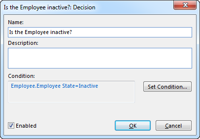

## Decision

A decision controls the flow of execution by grouping a set of actions that should only be executed if a certain condition is fulfilled. A decision can contain effects, controls, and other blocks.

To spedify advanced operations, the decision is used in combination with effects, controls, and other blocks. See also these articles for information on [enumerating](enumerator.md) over more than one object, repeating operations in a [while loop](while loop.md), [redirecting](../controls/redirect execution.md) the execution flow, and [committing](scope.md) changes to data.

*   **Name**. The name is optional, and if there is no name, a summary of the condition is displayed in the Action tree.
*   **Description**. The description is optional.
*   **Condition**. If the condition is fulfilled, the steps inside the decision block is executed. See here for more information on defining [conditions](../../../common concepts/conditions.md).
*   **Enabled**. Default selected. Clear the check box to disable the decision and all actions within it.