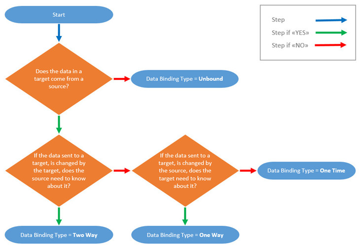
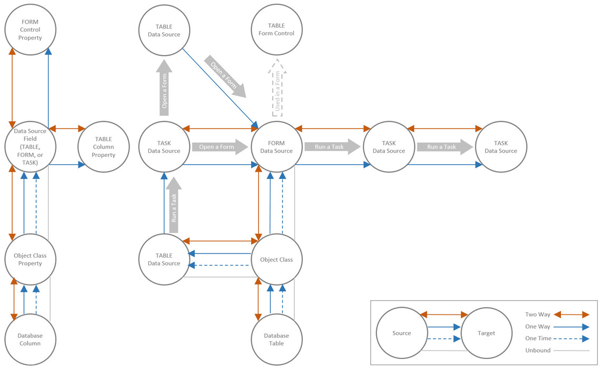

## Data Binding

Data binding is used to determine how initial and changed data flow within the application. A data binding establishes a connection between two data elements in the application model, where one is the Source and one is the Target. The data binding has a type which determines how the data flows between the source and the target.

<table style="WIDTH: 100%">

<tbody>

<tr>

<th>Data Binding Type</th>

<th>Initial Data in Source</th>

<th>Changes in Source</th>

<th>Changes in Target</th>

<th>Summary</th>

</tr>

<tr>

<td>Two Way</td>

<td>Is sent to the target</td>

<td>Are sent to the target</td>

<td>Are sent back to the source</td>

<td>New and changed data are exchanged between the source and the target.</td>

</tr>

<tr>

<td>One Way</td>

<td>Is sent to the target</td>

<td>Are sent to the target</td>

<td></td>

<td>New and changed data are sent from the source to the target, not the other way.</td>

</tr>

<tr>

<td>One Time</td>

<td>Is sent to the target</td>

<td></td>

<td></td>

<td>The data in the source is sent to the target, but only once, and not the other way. Any succeeding changes are not sent to the target.</td>

</tr>

<tr>

<td>Unbound</td>

<td></td>

<td></td>

<td></td>

<td>This represents a special case, where there is actually no binding between a source and a target. There is really only a target. It is typically used to create temporary data sources and properties that only exist in memory.</td>

</tr>

</tbody>

</table>

Data bindings are used as bridges for data between elements in the application model, for example a Form and a Task. If the Task is run from the Form, the Form is the Source and the Task is the target, and if the Form is opened from the Task, the Task is the Source and the Form is the target.

To determine which type of data binding to use, asking the following questions may help:

We have stated that data binding helps us control the flow of data within the application. So what are the cases where the source or target needs to know about changes to the data, or not. Often the decisions in these cases are based on requirements for when the information is committed, or saved.

Let us consider the following case:

In a form for adding a new company, there is a task to retrieve detailed company information from an online service. Before saving the new company we wish to verify or edit the retrieved information. In this case the task that retrieves the information cannot save the information, but is required to hand it over to the form. The form will then decide what happens to the information, and in this case the information is presented to the user, which may or may not edit and save it.

To achieve this, the task that retrieves the detailed online information must be allowed to add information to the company object, and then send it back to the form. This is done by binding the company data source in the task to the company data source in the form using two way binding. The task then uses non-committing scopes and updates the company data source in memory only.

Data binding can be performed on the object level, typically a data source containing one or more objects, and on the property level, typically a field containing a value. In the application model a data binding is defined at the target, and is thereby defined by two settings; the source and the type. It is customary to say that the target bis bound to theb source. In some cases the type is not available for a property level data binding, and in these cases the type of binding is already defined in the object level.

To better understand the wide variety of uses of data bindings, let us consider some examples:

*   An object class is bound to a database table, to make the data in the table available in the application
*   A number edit field in a form is bound to a data source property, to edit the number value of the property.
*   The track bar edit min / max value properties are bound to properties in a data source, to configure the track bar based on the data instead of using constant values.
*   A data source in a task is bound to a data source in another task, to be able to pass data sources as parameters between tasks when breaking down complexity and re-using tasks.
*   A data source in a table is bound to a data source in a form, to open one of the objects listed in the table in a form.

The following figure illustrates some of the different types of binding between different types of sources and target.

It is important to distinguish between binding and filtering, as the figure focuses on bindings. For example; in addition to binding data sources when running a task, the task can have many data sources without any binding, which instead are populated by defining a data filter based on criterias. In fact, some tasks do not require any bound data sources at all to run.  

In the figure, there are connections where all types of binding are possible, and there are connections where not all types of binding are relevant. There are also connections where all, or some, types of binding are missing. For example, when opening a table from a task, when using a table as a control in a form, or when opening a form from a table. The binding types are missing for certain connections because they are not yet implemented.