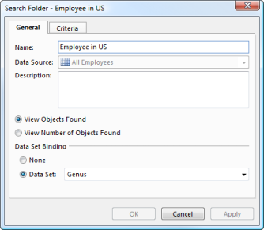
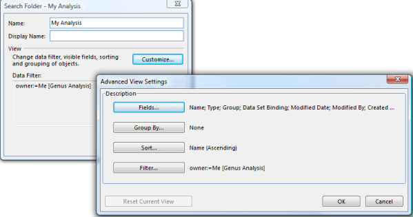

## Search Folders

Search Folders makes it easy to find and organize objects. A Search Folder is a logical view of related objects, and is simply a saved search with custom view settings. If the user has access to a search folders, it can be accessed from [Search Task Pane](../searching for data.md). When the search folder is opened, the saved search is executed.

**Specific Objects Search Folders**  

Search folders of type Specific Objects, allow you to save criteria based searches for data sources with specified basic view or table view.  

To create a new specific objects search folder, do the following:

1.  [Open Genus Studio](genus studio basics/how to open genus studio.md).
2.  In the **Directory** tree, click **Search Folders**.
3.  On the toolbar, click **New****** **** and click **Search Folders (Specific Objects)**. Optionally, right-click anywhere in the **Search Folder** window, and in the shortcut menu, point to **New** and then click **Search Folder (Specific Objects)**.
4.  In the **General** tab and in the **Name** box, type the name for the search folder. In the **Data Source** box, select available [basic view](object class/modify an object- or identifier domain/explore.md) or [table view](tables/views.md). Note that only views that are enabled for Search View are available in the Data Source box. To enable execution of the search folder, **Enable Search** for the data source or the table view has to be selected.
5.  Select **View Objects Found**, to view a list of found objects.
6.  Select **View Number of Objects Found**, to only see the number of Objects Found. If it is uncertain how many objects the search will return, select this option to avoid unnecessary waiting.
7.  In **Data Set Binding** section, click **Data Set** and select a data set
8.  Click **OK**.
9.  Right-click the search folder, and click **Open**, or double-click the search folder to open.
10.  In the **Search Folder** dialog box, click **Criteria** tab.
11.  Set the criteria for the search folder. For more information about how to set criteria, see [Conditions](common concepts/conditions.md).

**Generic Objects Search Folders**  

Search folders of type Generic Objects, allow you to save searches for Reports. This makes it easier to find and organize reports, for example reports where you are the owner, or reports with specific tags. 

To create a new generic objects search folder, do the following:

1.  In the **Directory Tree**, click **Search Folders**, and then on the toolbar, click **New******.
2.  In the **Name** box, type a name for the Search Folder.
3.  Optionally type a display name in the **Display Name** box.
4.  Click **Customize** to set data filter, visible fields, sorting and grouping.  

<table style="WIDTH: 100%">

<tbody>

<tr>

<th>Customize Option</th>

<th>Description</th>

<th>To add</th>

</tr>

<tr>

<td>**Fields**</td>

<td>Specify which fiels to display the search result.</td>

<td>

1.  In the **Field Chooser** box, select wanted fields.
2.  To move a field, click the field you want to move.
3.  Click **Move Up** or **Move Down** until the field is in the position that you want.
4.  Click **OK**.

</td>

</tr>

<tr>

<td>**Group By**</td>

<td>Group the search on one or more fields. When grouping objects in a table, the objects are displayed below a shared heading. When grouping objects in a table, the objects are displayed below a shared heading.</td>

<td>

1.  In the **Group By** box, select the field to group by.
2.  To enchance grouping by, select a group interval in the **Group Interval** list.
3.  In the **Initial Display** list, select if the groups should be expanded or collapsed as default.
4.  To group by an additional field, click **Add**.
5.  Click **OK**.

</td>

</tr>

<tr>

<td>**Sort**</td>

<td>Change the sort order.</td>

<td>

1.  In the **Sort By** box, select a field to sort by.
2.  Click **Ascending** or **Descending** for the sort order.
3.  To sort by an additional field, click **Add**.
4.  Click **OK**.

</td>

</tr>

<tr>

<td>**Filter**</td>

<td>Set criteria for the Search Folder.</td>

<td>To add more search fields, click **Fields** button and in the **Select Search Fields** box, add fields.</td>

</tr>

</tbody>

</table>