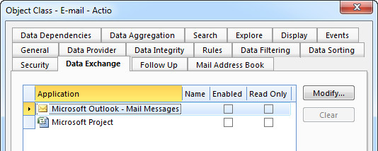
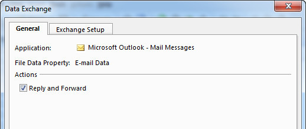

# Data Exchange

Data Exchange offers added functionality in integration with external applications.

## Data Exchange - Microsoft Outlook - Mail Mail Messages

Data Exchange for Microsoft Outlook Mail Messages enables the users to reply and forward directly to e-mails attached to an object. This is only available for object classes which is defined with an attached file or e-mail. For more information see [Attach a File or an E-mail To an Object](../../../../how-to/attach-a-file-or-an-email-to-an-object.md "Attach a File or an E-mail To an Object"). The reply or forwarded e-mail can automatically be saved as a new object alongside the original e-mail. The new e-mail can be composed by using values from both the original object and the replied or forwarded message.

To set up Data Exchange for Microsoft Outlook Mail Items, do the following:

1.  In the **Data Exchange** tab, select the **Microsoft Outlook - Mail Messages** and click **Modify**.  
    
2.  In the **Actions** section select **Reply and Forward**.  
    
3.  Select the **Exchange Setup** tab.
4.  In the **Replied and forwarded mail messages** section, click **Modify**.  
    
5.  In the **General Tab** assign values to the fields for the new object. For more information on assigning values see [Create Objects and Modify Objects](../../../logic/action-orchestration/actions/effects/create-objects-and-modify-objects.md "Create Objects and Modify Objects").  
    
6.  Click **OK** to close.

