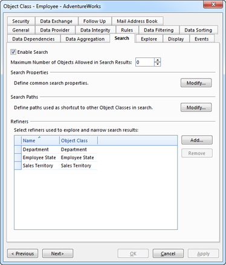
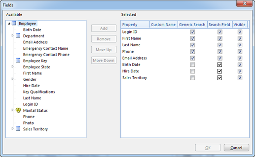

# Search

 **Enable Search** 

Select this option to allow users to search for data.

**Maximum Number of Objects Allowed in Search Results**

Type or select a number to limit the number of objects in the search results. The number zero is defined as no limit. When the maximum limit is exceeded during a search, a warning is displayed. This property is useful when there is a risk that the end user can perform a search which returns too much data. The definition of btoo much dataB; varies from application to application, but is typically characterized by timeouts for the user or performance penalties for other users, and is often subject to either CPU or memory limitations.

**Define common search properties**

Defines the properties used for searching, either as specific search fields in the search pane, or as properties included in a generic search. Note that you must specify a [filter method](../../object-class-property/modify-an-object-class-property/data-filtering.md) for all properties used in the search pane.

To modify search properties, click **Modify**:

*   To add a property, in the **Available** list, select the property , and click **Add**. Note that you can choose properties defined in the Object Class itself, or properties defined in referred Object Classes. Selecting a property from a referred Object Class is somewhat similar to providing a search path to the Object Class containing the property. The user can however only enter a criterion for the selected property. You should be careful using this functionality unless the purpose is unambigious to the user.
*   To add a [range roperty](data-dependencies.md), in the **Selected** list, right click and then click **Add Path**. Click **Range Property**. and in the **Range Property** box select a range property. 
*   To remove a property, in the **Selected** list, select the property, and click **Remove**.
*   To change the order of the search properties. In the Selected list, click a property, and click **Move Up** or **Move Down**.
*   To enter a name for a search property, click in the **Custom Name** cell for the property and press **F2** to edit the name. You would typically use a custom name if the selected property is defined in a referred Object Class. For example, selecting a property named Code in a referred Object Class, would give little meaning in the context of another Object Class. In all other cases it is recommended to use the name for the selected property. If you later change the name for the property, the name for the search property change accordingly.
*   Select **Include in Generic Search** to include this field in simple one-field searches. This option is only available for properties containing text.
*   Click to clear **Enable As Search Field** if the property should not be available in the search pane. This is only possible if **Include in Generic Search** is selected.
*   Click to clear the **Default Visible** check box if the property should not be displayed in the search pane by default. This is only possible if **Enable As Search Field** is selected.

To change the display order for a search property, click the property in the list, and then click **Move Up** or **Move Down**.

## Search Paths

Search Paths are used to find objects given search criteria on other Object Classes. For example, to find customers with payments placed for collection. The search paths are available as shortcuts to other object classes in the Group folder in [Advanced Search](../../../../../users/search-and-refine/using-advanced-search.md "Using Advanced Search").

To add a search path, do the following:

1.  Click **Modify**.
2.  In the list of search paths, click **Add**.  
    
3.  In the **Name** box, type a name for the path.  
    
4.  To specify a path, click **Modify**.
5.  A path condition defines the path from one object class to another, via other object classes if necessary. The step between two object classes is defined by conditions between the properties of the two object classes. For further information see [path conditions](explore.md#path-condition "Path Condition").
6.  Click **OK**.

## Refiners

Defines which refiners to display in the refinement panel. To create new refiners, see [Create a Refiner](../../../../../users/search-and-refine/refiners.md "Create a Refiner").

1.  In the **Select refiners used to explore and narrow search results** list, click **Add.**
2.  In the **Available Refiners** list select the refiner you want to add, and then click **Add**.
3.  Click **OK**.

