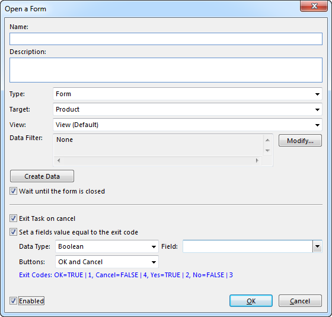
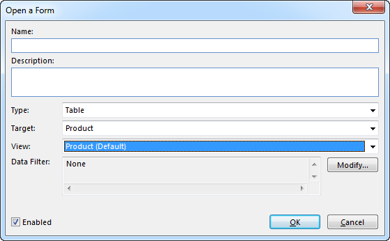
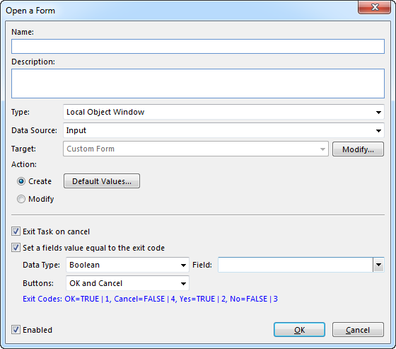
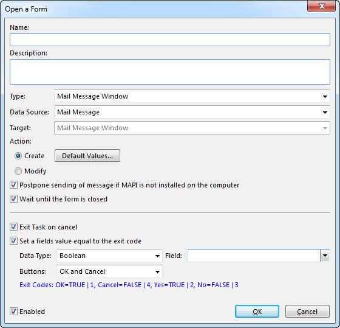
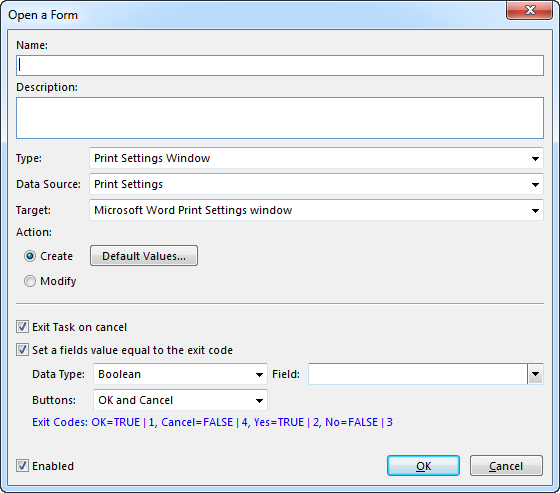
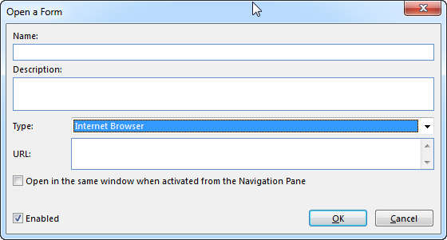
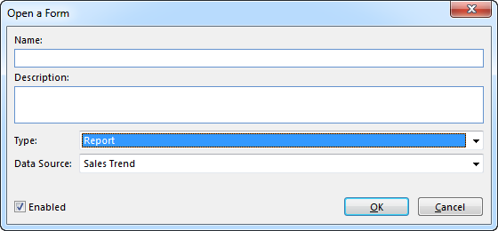

# Open a Form

Use this effect to open a form where the user can fill out and save data for a new or existing objects, work with data in a table, or view the content of a Report or a web page.

## Form

Open a Form, to create or modify data.

1.  In the **Name** box, optionally type a name. The name is displayed in the action tree, if a name is not entered, a summary of the effect is displayed.
2.  In the **Description** box, optionally type a description.
3.  In the **Type** box, select *Form.*
4.  In the **Target** box, select a form.
5.  In the **View** box, select a view from the form selected in the **Target** box.
6.  The **Data Filter** specifiy which data the form loads when opened. It is possible to change the default data filters for public data sources in the form. Click **Modify**, and then for each of the data sources in the list, click **Modify** to [specify a data filter](../../data-sources/specifying-a-data-filter-for-a-data-source.md).
7.  To create new objects when the form is opened, click **Create Data**, and then for each data source, click **Add**. In the **Create Object In** list, select a data source from the form. In the **Default Values** box click **...** and [assign values](create-objects-and-modify-objects.md) to the groups and fields in the data source. If the form is opened in a modal window the created data can be returned to the task when the form is closed, to achieve this the data source in the task to receive the data must be specified through data binding. In the **Copy Object Back To** box click **...** and select a data source to receive the data.
8.  If you want to execute succeeding actions immediately without waiting for the user to close the form, click to clear the **Wait until the form is closed** check box. Note that if the data source not is persisted, you can not clear this option. When this option is selected. the form is opened in a modal window.
9.  Select the **Exit Task** **on cancel** check box if you do not want to execute suceeding effects if the user chooses the **Cancel** button in the form. This option is only available if the **Wait until the form is closed** check box is selected.
10.  To store which button is chosen by the user, click **Set a fields value equal to the exit code**. You can either store the response as a boolean value or an integer value. See the article [Dialog Box Exit Codes](dialog-box-exit-codes.md "Dialog Box Exit Codes") for an overview of exit codes. Only available if the **Wait until the form is closed** check box is selected.

## Table

Open a Table, to list and work with data.

1.  In the **Name** box, optionally type a name. The name is displayed in the action tree, if a name is not entered, a summary of the effect is displayed.
2.  In the **Description** box, optionally type a description.
3.  In the **Type** box, select *Table.*
4.  In the **Target** box, select a table.
5.  In the **View** box, select a view from the table selected in the **Target** box.
6.  The Data Filters specify which data the table loads when opened. It is possible to change the default data filters for public data sources in the table. Click **Modify**, and then for each of the data sources in the list, click **Modify** to [specify a data filter](../../data-sources/specifying-a-data-filter-for-a-data-source.md "Specifying a Data Filter for a Data Source").

## Local Object Window

Open a simple form, to create or modify a custom data source.

1.  In the **Name** box, optionally type a name. The name is displayed in the action tree, if a name is not entered, a summary of the effect is displayed.
2.  In the **Description** box, optionally type a description.
3.  In the **Type** box, select *Local Object Window.*
4.  In the **Data Source** box, select a custom data source.
5.  In the **Target** box, Custom Form is pre-selected select. To modify the custom form, click **Modify**. Enter a title and description for the form in the appropriate boxes. In the **Fields** list select a field and click **Modify** to open the **Field Properties** dialog. To change the data filter for the field, in the **Data Filter** box, click **Modify** and specify the [data filter](../../../../../../users/analyze-report-and-discover/report/data-filters.md). This option is only available for complex data types. To hide the field in the custom form, click to clear the **Visible** check box. To change the order of the fields, click a field and click **Move Up** or **Move Down**.
6.  To create a new custom object when the form is opened, in the **Action** section click **Create**. To assign default values for the new object, click **Default Values**, and [assign values](create-objects-and-modify-objects.md) to the groups and fields in the data source. To modify an existing custom data source object, in the **Action** section click **Modify**.
7.  Select the **Exit Task** **on cancel** check box if you do not want to execute suceeding effects if the user chooses the **Cancel** button in the form. This option is only available if the **Wait until the form is closed** check box is selected.
8.  To store which button is chosen by the user, click **Set a fields value equal to the exit code**. You can either store the response as a boolean value or an integer value. See the article [Dialog Box Exit Codes](dialog-box-exit-codes.md "Dialog Box Exit Codes") for an overview of exit codes. Only available if the **Wait until the form is closed** check box is selected.

## Mail Message Window

Open Microsoft Outlook if it is installed on the computer, or otherwise open a simple mail message window.

1.  In the **Name** box, optionally type a name. The name is displayed in the action tree, if a name is not entered, a summary of the effect is displayed.
2.  In the **Description** box, optionally type a description.
3.  In the **Type** box, select *Mail Message Window.*
4.  In the **Data Source** box, select a mail message data soure.
5.  In the **Target** box, *Mail Message Window is automatically selected.*
6.  To create a new mail message object when the form is opened, in the **Action** section, click **Create**. To assign default values for the new object, click **Default Values**, and [assign values](create-objects-and-modify-objects.md "Create Objects and Modify Objects") to the groups and fields in the data source. To modify an existing mail message data source, in the **Action** section, click **Modify**.
7.  If MAPI is not installed on the computer, you can choose to postpone to send the message. To do this, select the **Postpone sending of message if MAPI is not installed on the computer** check box. You can send the message in a suceeding effect of type [Create a Mail Message](create-a-mail-message.md "Create a Mail Message").

8.  If you want to execute succeeding actions immediately without waiting for the user to close the form, click to clear the **Wait until the form is closed** check box. Note that if the data source not is persisted, you cannot clear this option. When this option is selected. the form is opened in a modal window.
9.  Select the **Exit Task** **on cancel** check box if you do not want to execute suceeding effects if the user chooses the **Cancel** button in the form. This option is only available if the **Wait until the form is closed** check box is selected.
10.  To store which button is chosen by the user, click **Set a fields value equal to the exit code**. You can either store the response as a boolean value or an integer value. See the article [Dialog Box Exit Codes](dialog-box-exit-codes.md "Dialog Box Exit Codes") for an overview of exit codes. Only available if the **Wait until the form is closed** check box is selected.

 **Mail Message Considerations**

Note! Leave the **From** address field blank for mail messages sent from an MS Outlook client. The **From** address i automatically filled out with the correct address when the mail message is opened in the MS Outlook client. Even if you specify a valid SMTP-address, MS Outlook may not be able to look up the address in the address book. You may also experience problems concerning privileges when the mail message is sent. 

## Print Settings Window

Open the standard windows print settings dialog.

1.  In the **Name** box, optionally type a name. The name is displayed in the action tree, if a name is not entered, a summary of the effect is displayed.
2.  In the **Description** box, optionally type a description.
3.  In the **Type** box, select *Print Settings Window.*
4.  In the **Data Source** box, select a print settings data soure.
5.  In the **Target** box, select *Microsoft Word Print Settings* window or *Microsoft Excel Print Settings* window to specify which type of print settings window to use.
6.  To create a new print settings object when the form is opened, in the **Action** section, click **Create**. To assign default values for the new object, click **Default Values**, and [assign values](create-objects-and-modify-objects.md "Create Objects and Modify Objects") to the groups and fields in the data source. To modify an existing print settings data source, in the **Action** section, click **Modify**.
7.  Select the **Exit Task** **on cancel** check box if you do not want to execute suceeding effects if the user chooses the **Cancel** button in the form. This option is only available if the **Wait until the form is closed** check box is selected.
8.  To store which button is chosen by the user, click **Set a fields value equal to the exit code**. You can either store the response as a boolean value or an integer value. See the article [Dialog Box Exit Codes](dialog-box-exit-codes.md "Dialog Box Exit Codes") for an overview of exit codes. Only available if the **Wait until the form is closed** check box is selected.

## Internet Browser

Open the default internet browser.

1.  In the **Name** box, optionally type a name. The name is displayed in the action tree, if a name is not entered, a summary of the effect is displayed.
2.  In the **Description** box, optionally type a description.
3.  In the **Type** box, select *Internet Browser.*
4.  In the **URL** box type an URL. You can generate a dynamic URL by [inserting fields from your data sources](../generate-dynamic-values-for-text-fields.md "Generate Dynamic Values for Text Fields") as part of the URL.
5.  By default, the URL is opened in a new browser window. To open the URL in the main window when the effect is activated from a shortcut to a Task in the Navigation Pane, click **Open in the same window when activated from the Navigation Pane**.

## Report

Open a Report.

1.  In the **Name** box, optionally type a name. The name is displayed in the action tree, if a name is not entered, a summary of the effect is displayed.
2.  In the **Description** box, optionally type a description.
3.  In the **Type** box, select *Report.*
4.  In the **Data Source** box, select a report data source.

See Also

*   [Dialog Box Exit Codes](dialog-box-exit-codes.md)