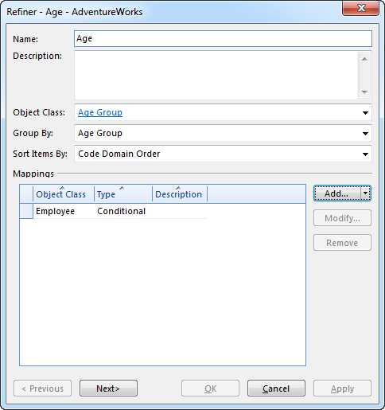
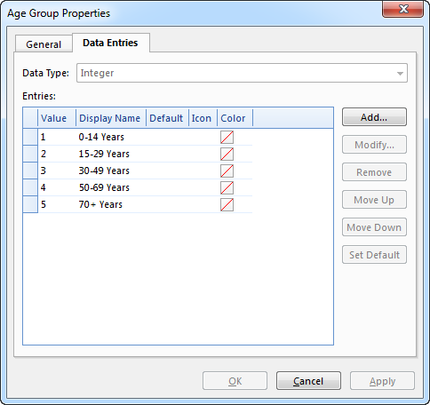
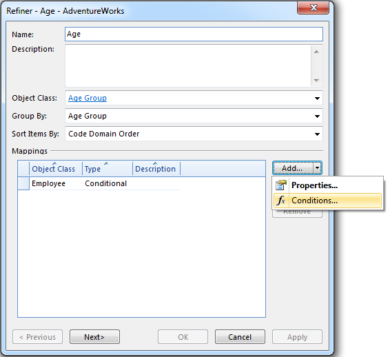
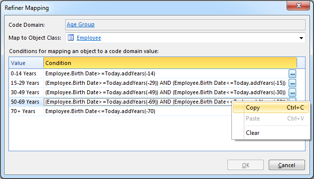

## Refiners

Genus offers dynamic refinement of search results, by aggregating the result into categories, called Refiners. Each refiner has one or more refinement links which represents the items in that category, and each refinement link represents a filter that can be applied to the search result. By selecting a refinement link, the search result is narrowed and only matching objects are kept. Only the refinement links that are relevant in the search result are shown, and they are continuously updated in the background to reflect changes in the search result. The refiners and refinement links are available in the refinement pane, and each refinement link displays the exact number of matching objects, so you immediately know how many objects you will get by selecting the refinement link.

For more information on how to filter search results using refiners, see [Refining Search Results](../../users/search-and-refine/refining-search-results.md).

A refiner can be mapped directly to properties, or through conditions to create custom intervals or categories.

Typical scenario for property mapped refiners could be:

*   Use an object class containing types, states, or other codes as a refiner, with the identifier as the search term. This means that it is the objects themselves that are the search terms, and that the refiner can be used with properties referencing the object class.
*   Use a textual code property or name property as the search term. Such a refiner can be used with any character based property, like for example a description property, and will effectively filter objects based on matches within the description text.

Typical scenarios for condition mapped refiners could be:

*   Price intervals for real estate.
*   Age intervals classifying accounts receivable (0-30 days, 31-60 days etc.).
*   Age groups classifying employees.
*   Customer credit rating based on different criteria.

Custom categories are always defined by Code Domains in your Directory. For a given Conditional refiner bound to a Code Domain, a mapping to an Object Class is defined by specifying a condition for each value in that Code Domain.

For information on how to publish your refiners, see [Search](object-class/modify-an-object--or-identifier-domain/search.md) and [Views](tables/views.md).

## Create a Refiner

1.  [Open Genus Studio](getting-started/how-to-open-genus-studio.md)
2.  In the **Directory** tree, click the **Refiners** folder, and then on the toolbar, click **New.**  
    
3.  In the **Name** box, type a name for the Refiner.
4.  Optionally type a description in the **Description** box.
5.  In the **Object Class** box, select which object class to use as the dimension for the refiner.
6.  In the **Group By** box, select the object class itself or a property of the object class to use for grouping items into refinement links.
7.  In the **Sort Items By** box, select **Objects Found** to list the refinement links with the most objects first, or select **Name** to list the refinement links in alphabetical order. If the Object Class is a Code Domain, select **Code Domain** **Order** to list the refinement links in the order defined by the code domain.
8.  Click **Add** in the **Mappings** section to specify which object classes and properties the refiner can be used to filter.
9.  Select a property the refiner should search in. The property must be of the same data type as the **Search Term Property**.
10.  Repeat 8 and 9 for all filtered properties
11.  Click **OK**.

## Create a Conditional Refiner

1.  [Open Genus Studio](getting-started/how-to-open-genus-studio.md).
2.  In the **Directory** tree, click the **Object Class** folder
3.  [Create a code domain](data/object-class/create-or-modify-a-code-domain.md) representing your custom category. For example a set of Age Groups:  
    
4.  In the **Directory** tree, click the **Refiners** folder, and then on the toolbar, click **New**.
5.  In the **Name** box, type a name for the Refiner. For example Age
6.  Optionally type a description in the **Description** box.
7.  In the **Object Class** box, select the code domain you created in step 3,which is then used as the dimension for the refiner.
8.  In the **Search Term Property** box, select the identifying property of the code domain.
9.  In the **Sort Items By** box, select **Code Domain Order** to list the refinement links in the logical order of the values in the code domain .
10.  Click the **Add** arrow in the **Mappings** section, and select **Conditions** to open the **Refiner Mapping** dialog.  
    
11.  In the **Map to Object Class** box select the object class to filter, and for each of the values in the code domain define the [conditions](common-concepts/conditions.md) to use for filtering the object class. Note! If the conditions are very similar , you can copy a condition from one value to another, and then modify the condition. To do this, right-click a condition, and then in the shortcut menu, click **Copy**.  
    
12.  Repeat 10 and 11 for all object classes to map.
13.  Click **OK**.

For information on how to publish your refiners, see [Search](object-class/modify-an-object--or-identifier-domain/search.md) and [Views](tables/views.md).

