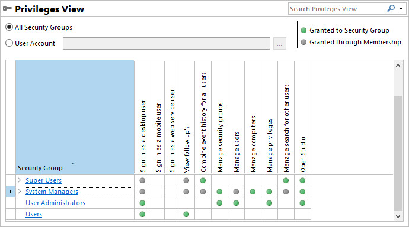
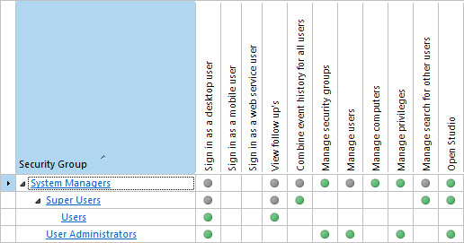
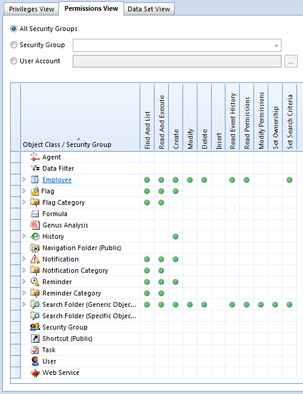
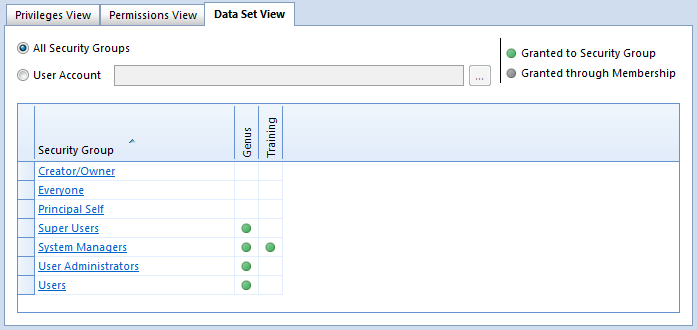

# Security Overview and Review

The **Privileges View,** **Permissions View**, and **Data Sets View** in Genus Studio facilitate a periodic review of important security aspects, such as privileges, Object Class permissions, and Data Set access granted to security groups. To open the views, select the **Security** folder in the **Directory** tree.

## Privileges View

The view summarizes privileges granted to security groups. If a privilege is granted directly to a security group, the grant is indicated with a green circle. If the privilege is granted through a membership in another group, the grant is indicated with a gray circle

By default, privileges are displayed for all security groups. To restrict the view to security groups an individual account is member of, click User Account, and then in the User Account box, select an account.

Some privileges are not granted directly to a security group, but may be granted indirectly through memberships in other security groups. To explore these memberships, expand the security group.

In the example below, the System Manager security group has been granted the privilege _Sign in as a desktop user_ through the membership in the Super Users security group. The privilege has not been granted to the Super Users security group directly, but is granted through the membership in the Users security group.

## Permissions View

The view summarizes Object Class permissions granted to security groups. If a permission has been granted to an Object Class, the grant is indicated with a green circle (at least one grant is unconditional) or a yellow triangle (all grants are conditional). To explore which groups that have been granted the permission, expand the Object Class. Grants are indicated using one of the following symbols:

Some permissions are not granted directly to a security group, but may be granted indirectly through memberships in other security groups. To explore these memberships, expand the security group.

By default, permissions are displayed for all security groups. You can restrict the view to one security group, or security groups which an account is member of.

## Instance View

The view summarizes permissions granted for individual instances of objects, for example: Analyses, Reports, Shortcuts, Tasks, etc.

In the **Type** box, select the type of objects to list.

In the **Permission** box, select the type of permission to view a summary for.

The objects of the selected type are listed, with a column for each security group.

A green circle in a cell indicates that the securtiy group in that column is granted the selected permission to the object in that row. A gray circle indicates that the security group is granted the selected permission to the type of object, i.e. to all objects of the selected type of objects.

The Private Grants columns shows the number of permissions granted to individual user accounts. If there are only private grants and no permissions granted to any group, the object is private, which is often incorrect.

In addition to selecting the type of objects to show, and the type of permission to summarize, the columns for individual security groups can be hidden or shown. The summary information is updated according to what groups are visible, which can be useful for example by hiding a _System Manager_ group which may have been granted permissions to all objects.

## Data Sets View

The view summarizes access to [data sets](../general-settings/data-sets.md) granted to security groups. If access is granted directly to a security group, the grant is indicated with a green circle. If access is granted through a membership in another group, the grant is indicated with a gray circle

By default, access is displayed for all security groups. To restrict the view to security groups an individual account is member of, click User Account, and then in the User Account box, select an account.

