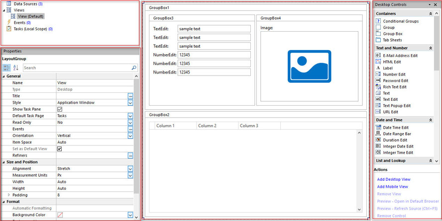
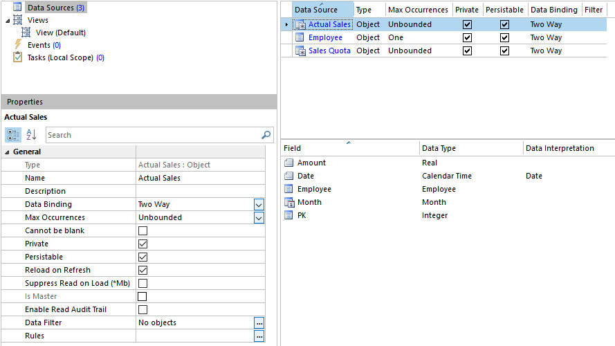

# Form designer

Use the form designer to define a form by adding the data sources to use, one or more views, the events to react to, and any local tasks.

To edit a form in the designer, go to the list of forms in Genus Studio, locate the form, and double click it, or right click and select **Open**.

To view the form definition in a read only mode, press and hold the CTRL+SHIFT keys when opening the form. This prevents the form from being locked for other modelers, and it is not possible to save any changes to the form.

## Designer window content

The form designer window is structured to provide an efficient and consistent work area.

*   In the upper left corner, the main parts of the form definition are listed; data sources, views (instances), events, and local tasks. To view or edit one of them, just click on the entry, to display the definition in the center area of the form designer.
*   The center area displays detailed information for the part of the form definition that is selected in the upper left corner. For views the visual layout is displayed, and for the other parts, the data sources, events or tasks are listed, respectively. In this
*   In the lower left corner, the properties of the currently selected item are listed. For views the properties of a control in the layout are listed. For data sources, the properties of data source or data source field that is selected are listed. For events and tasks the properties for these are selected.
*   On the right is the task pane which can display different types of available controls or data sources, or a hierarchical structure of the controls in the current view layout.

### Data sources

Add or remove [data sources](../tables/data-sources.md "Data Sources") by right clicking in the data source list. Select a data source in the list to see its properties and fields, or select a field to see its properties.

### Views

To change a [view](views/index.md "Views"), click on it and edit the layout. To see the properties of the controls in the layout, select the control.

### Events

Add or remove [events](events.md "Events") by right clicking in the event list. Select an event in the list to see its properties.

### Tasks

Lists the [tasks](tasks.md "Tasks") that are local to the form. Add or remove tasks by right clicking in the list.

### Task pane

The task pane provides access to data sources, layout controls, etc. depending on the current context. To view the different contents of the task pane, in the task pane header, click the down arrow, and then select the content to view.

The content of the task pane varies depending on the context, and the current definition of the form, For example;

 

The Control View displays the controls used in the view layout, but in a tree structure. This is useful for complex layouts to more easily access controls and change the layout.

