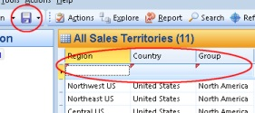
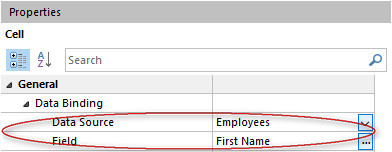
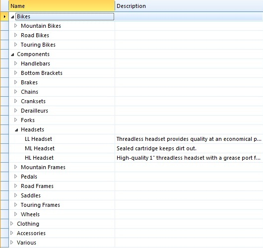
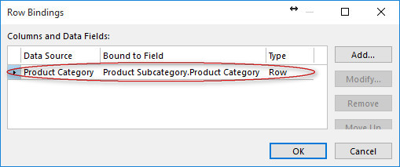
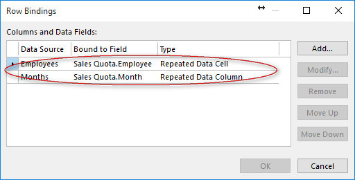

# Layout

When you design a table you must consider how to lay out and configure the elements in the table. Generally, you should organize the elements so that users who fill it out can enter data in a logical manner. The table layout designer helps you achieve this goal.

A table layout is composed of columns, row templates, cell templates, and data fields. Each row template in the table is bound to a data source, and cell templates are bound to fields within a data source. You can present data from multiple data sources within the same table.

Data fields enables users to work more efficiently with large amounts of data. For example, if you are designing a table for entering estimated amount of anticipated sales allocated by product and territory, you may want users to enter sales figures for one product at a time. To do this you can add a data field bound to a data source containing products. This enables users to select a product from a drop-down list box, and then enter sales figures by territory and month.

To define a layout for your table, in the **Table Description** area, click **Layout**. The **Layout Grid** displayed in the **Layout** area enables you to add and modify columns, row templates, cell templates and data fields. To add an element to the **Layout Grid**, you can simply drag a data source or field from the **Task Pane** into the different areas of the grid. To modify an element in the **Layout Grid**, click the element.

Depending of the type of table, the **Layout Grid** is divided into different areas. The examples below illustrates the layout for a basic table and a multidimensional table:

### Basic table layout

### Multidimensional table layout

## Add a row template

Do one of the following:

*   In the **Task Pane**, click **Add a Row**.
*   Drag a data source from the **Data Sources** page in the **Task Pane** into the row template area of the **Layout Grid**.

When you drag a data source from the **Task Pane** to add a new row template, the row template will automatically be bound to the data source. If the row template is unbound, do the following:

1.  Make sure the row is selected in the **Layout Grid**.
2.  Locate the properties of the row on the lower left in the window.
3.  In the **Data Source** box in the **Data Binding** section, select the data source which you want to bind the row template to.

### Row template properties

Property                      | Description
------------------------------|----------------------------
Automatic Formatting          | Applies a format to the row based on a condition. For more information, see the article [Automatic Formatting](../../common-concepts/automatic-formatting.md).
Data Binding                  | Defines which data source the row template presents data from, and bindings to another Row Template, Data Fields, Identifying Data Columns, or Repeated Data Columns. For more information, see the article [Bind a Row Template to another Row Template, Columns, or Data Fields](layout.md).
Draft missing objects         | Applies to tables with a multidimensional layout. When data is read for a data source bound to a row template, the objects are laid out in rows and columns based on the binding between the row and Identifying Data Columns and Repeated Data Columns. If the data is not yet complete, some combinations will not be populated by an object. However, you may want to fill out missing data points with new objects, and evaluate rules and data calculations for these objects. When an object is drafted, all initial rules, data calculations, and data validations are evaluated. The object is considered as a draft until the user enters a value in a cell. Drafted objects are not saved.
Flatten Nested Data Structure | Represents nested (recursive) data as a data source without a nested structure. If this option is not checked, the data source is presented as a expandable and collapsable hierarchy of objects.  Note: **Flatten Nested Data Structure** check box is only avaiable, if the selected **Object Class** is defined as Nested Data.
Format                        | Applies a static format to a row, such as font settings and background color.
New Row Visible               | If you want to control if users are allowed to add objects by entering data in the new-item row displayed at the top of the table (as opposed to open a Form to enter data), you can make the new row visible or not.    This setting applies to tables with basic layout, and only one of the top level row templates can have the new row visible at the time.  <ul><li>If the new row is never visible, select **No**.</li><li>If the new row is always visible, click **Yes**.</li><li>If the new row is visible if a specified condition is true, select **Enter a condition**, and then [specify a condition](../../common-concepts/conditions.md)</li></ul>
Read Only                     | If you want to control the users ability to change the contents of rows, you can make the control read-only or not. To control if the rows are read-only, do one of the following:  <ul><li>If the rows are never read only, select **No**.</li><li>If the rows are always read only, select **Yes**.</li><li>If the rows are read only if a specified condition is true, click **Enter a condition**, and then [specify a condition](../../common-concepts/conditions.md).</li></ul>
Screen Tip                    | Text displayed when the user hovers the mouse over the row. You can either enter a static text, select a field containing the value for the screen tip, or enter a formula to compose a text.
Visible                       | To set the visibility of all the rows of a row template, do one of the following:  <ul><li>If the rows are alvways visible, select **Yes**.</li><li>If the rows are never visible, click **No**.</li><li>If the rows are visible if a specified condition is true, click **Enter a condition**, and then [specify a condition](../../common-concepts/conditions.md).</li></ul>

## Add a column

A column can be one of the following types:

*   Data
*   Group
*   Restricted Data
*   Identifying Data
*   Repeated Data
*   Summary Data

The last three column types, Identifying Data, Repeated Data, and Summary Data, are only available for tables with a multidimensional layout. The examples below illustrates the different types of columns:

### Example 1:

### Example 2:

Column Type                 | Description | To Add a Column of this Type
----------------------------|-------------|-----------------------------
Data | A **Data** column contains cells used for editing and presenting data. | Do one of the following:  <ul><li>In the **Task Pane**, click **Add a Column**.</li><li>Drag a field from the **Data Sources** page in the **Task Pane** into the **Columns** area of the **Layout Grid**.</li></ul>  When you drag a field from the **Task Pane** to add a new column, the name, data type and data interpretation for the column is filled out automatically. If the table contains a row template bound to the data source for the field, the cell template is automatically bound to the field.  To add a data column for selecting one or many values from a domain, click to expand the **Groups** folder in the data source, and then drag a group to the columns area of the layout grid. The group must be an object class which is part of the data source object class, and have a domain property defined. For more information, see [Object Class Composition](../../data/object-class/modify-an-object-or-identifier-domain/general-settings.md).
Group | A **Group** column can be added above one or more columns to divide the columns into logical groups. | In the **Layout Grid**, select the columns which you want to group, and then in the **Task Pane**, click **Group Columns**. To select more than one column, press the CTRL key, and then click which columns to group.
Restricted Data | A **Restricted Data** column is used to create a layout which enables users to make a single choice within a limited set of mutually exclusive choices. Each choice is presented in a separate column, and users make a choice by clicking a radio button. In *Example 2* illustrated above, responses in a job satisfaction questionnaire are graded on a scale from *Strongly Agree* to *Strongly Disagre*. To create one column for each choice, a column of type **Restricted Data** has been added to the layout. To determine the number of choices, the column has to be bound to a data source containing all choices. The control type for the cell template located below the column will automatically be set to **Radio Button**. | <ol><li>In the **Task Pane**, click **Add a Column**.</li><li>In the **Properties** area, in the **Type** box, select **Restricted Data**.</li><li>To bind the column to a data source, in the **Data Source** box, select a data source.</li></ol>
|| To illustrate the last three column types used in a multidimensional table layout; **Identifying Data**, **Repeated Data**, and **Summary Data**, we are going to use the following example:    This table presents sales quotas by employee and month. The green area represents **Identifying Data** columns, the blue area represents **Repeated Data** columns, and the read area represents **Summary Data** columns. |  
Identifying Data | To present a common set of values for all objects on a row, you can add **Identifying Data** columns to the layout. In the example above, the columns labeled *First Name* and *Last Name* are of type **Identifying Data**, and the cell templates located below these columns are bound to the *First Name* and *Last Name* field in the *Employee* data source.      That is, all sales quotas on the first row refers to the employee named *Kim Abercrombie*. | Before you can add an identifying column, you need to bind the row template to the data source containing the common set of values. For more information, see the article [Bind a Row Template to another Row Template, Columns, or Data Fields](layout.md).  To add an identifying column, drag a field from the identifying data source in the **Data Sources** page in the **Task Pane** into the **Identifying Columns** area in the **Layout Grid**.
Repeated Data | To present more than one object on a row, you can add a **Repeated Data** column to the layout. In the example above, sales quotas are repeated for a given set of months. To determine the number of months data should be repeated for, the column is bound to a data source containing months:      Note that when you bind a row template to other data sources repeated as rows and/or columns, the fields used to bind the row template to these data sources must uniquely identify an object. In the example above, it is assumed that no more than one sales quota is registered for any given employee in any given month. | <ol><li>In the **Layout Grid**, select the columns which you want to repeat, and then in the **Task Pane**, click **Repeat Columns**. To select more than one column, press the CTRL key, and then click which columns to repeat.</li><li>To bind the column to a data source, in the **Properties** area, in the **Data Source** box, select a data source.</li></ol>  To establish a relationship between the column and a row template, you need to bind the row template to the column. For more information, see the article [Bind a Row Template to another Row Template, Columns, or Data Fields](layout.md).
Summary Data | In a multidimensional table containing one or more **Repeated Data** columns, you can add **Summary Data** columns in order to present summarized values, such as total amount for all objects on a row. In the example above, the last column, *Total*, presents the total sales quota for an employee for all months. The total amount is fetched from a data source where data have been read into the data source by aggregating sales quota by employee for all months present in the table. Since summary columns presents data for more than one object, you need to bind cell templates located below a **Summary Data** column to the data source(s) which identifies the objects on a row:       | <ol><li>Drag a field from the **Data Sources** page in the **Task Pane** into the **Summary****Columns** area of the **Layout Grid**.</li><li>Make sure the cell is selected.</li><li>In the **Properties** area, in the **Row Binding** box, click .</li><li>Specify a condition which expresses which object(s) in the summary data source that should be presented on a given row.</li></ol>

### Column properties

Property                      | Description
------------------------------|----------------------------
Aggregation Method            | The statistical function to use when data are aggregated for rows and/or columns.
Allow Filter                  | The user can use autofilter to filter the table by this column.
Allow Group                   | The user can group the table by this column.
Allow Sort                    | The user can sort the table by this column.
Data Source                   | Defines the binding to a data source for columns of type **Repeated Data** and **Restricted Data**.
Data Type                     | Defines the kind of data cells in the column can hold. Read only. The data type will automatically be filled out when you bind a cell template to a field.
Format                        | Applies a static format to a column, such as number format, text alignment, font settings, and background color.
Freeze Column                 | Keeps columns to the left visible while users scroll through columns to the right.
Label                         | The caption for the column. To specify a fixed text, click **Text**, and then type a caption. To use the name of a field as caption, click **From Field**, and then select a field from one of your data sources. For columns of type **Repeated Data** and **Restricted Data**, the caption for the column is set equal to the value of the field for each object in the data source the column is bound to. For these types of columns you can also specify a caption by using a formula. For all other column types, the caption for the column is set equal to the name of the field.
Orientation                   | Defines the orientation of the column label: **Horizontal** or **Vertical**.
ScreenTip                     | Text displayed when the user hovers the mouse over the column. You can either enter a static text, select a field containing the value value for the screen tip, or enter a formula to compose a text.
Total Summary                 | Options for detemining how data summarized.
Total Summary - Column Label  | Enter a text for total summary column label.  This option is only available if **Repeated Data Columns** is selected.
Total Summary - Repeated Data Columns | Determines if data is aggregated and summarized for columns of type repeated data.
Total Summary - Rows          | Determines if data is aggregated and summarized for rows.
Type                          | The type of column. See above for a description of the different column types which are available.
Visible                       | To set the visibility of the column, do one of the following:  <ul><li>If the column is alvways visible, select **Yes**.</li><li>If the column is never visible, click **No**.</li><li>If the column is visible if a specified condition is true, click **Enter a condition**, and then [specify a condition](../../common-concepts/conditions.md).</li></ul>
Width                         | Controls the width of a column. By default, the width is adjusted to fit the column label and the contents in the column (**Auto**)**.** To prevent the automatic width from taking up too much space, specify the maximum width in the **max characters** box. To adjust the width to fit the contents only, click **Value**. To specify a specific width, click **Fixed**, and then type the width of the column measured in characters.

## Bind a cell template to a field

Do one of the following:

*   Drag a field from the **Data Sources** page in the **Task Pane** into the cell template.
*   In the **Layout Grid**, click the cell template. In the **Properties** area, in the **Data Binding** section, in the **Field** box, select the field you want to bind the cell template to.

Note that the data type for the selected field has to match the data type for the column.

If you bind a cell to a field located in a data source which not is bound to the row template, you need to specify a binding to the row. In the **Row Binding** box, click **[...]**, and then [enter a condition](../../common-concepts/conditions.md) specifying the binding. E.g., if you want to display transaction data from two separate systems on the same row, and there are no structural relationship between the two other than a transaction number, you can bind data from the other data source by specifying a condition such as:

*Transaction-Bound-To-Row-Template.Transaction-No = Transaction-Bound-to-Cell.Transaction-No*

Row binding is also used to map objects in cell templates located below **Summary Data** columns.

### Cell template properties

Property                      | Description
------------------------------|----------------------------
Automatic Formatting          | Applies a format to the cell based on a condition. For more information, see the article [Automatic Formatting](../../common-concepts/automatic-formatting.md).
Apply Field Value Color       | Available if the cell is bound to a field with a complex type pointing to a code domain. Applies the color associated with a code domain value as either the font color, or the background color of the cell.
Control                       | Defines the type of control used for editing and presenting data.  <ul><li>**Text Box**. Enables users to type plain text, dates and numbers. Applies to cells bound to a field with a character, numeric or date- and time based data type. Dates can be entered manually, or selected by clicking a date in a date picker.</li><li>**Label**. Applies to **Repeated Data** cells (as opposed to **Identifying Data** cells) located in **Identifying Data** columns. Users are not allowed to edit the value.</li><li>**Search Box**. Text box with a search button. Enables users to search for an object by clicking the search button, or type a text to look up an object. Applies to cells bound to fields with a complex data type pointing to an object domain. Generally you should use a Search Box if the complex data type contains a large number of objects to choose from.</li><li>**Drop-Down List Box**. Presents a list of objects when the user clicks the arrow to the right of the drop-down list. Applies to cells bound to fields with a complex data type. Generally you should use a Drop-Down List Box if the complex data type contains a limited number of objects to choose from.</li><li>**Check Box**. Enables users to make a true/false or yes/no choice. Check boxes are shown on the screen as a square box that can contain white space (for false) or a check mark (for true). Applies to cells bound to a boolean field or a complex type pointing to a code domain. If the cell is bound to a field with a complex type, you can specify the value when the check box is cleared and checked. For example, in a code domain representing the state for an employee as either *Employed* or *Left*, you could add a column labeled *Employed*, bind the cell to the *Employee.State field*, and set the value to *Left* when the check box is cleared, and *Employed* when the check box is selected.</li><li>**Radio Button**. Enables users to make a single choice within a limited set of mutually exclusive choices. Radio buttons are shown on the screen as small circles that can contain white space (for unselected) or a dot (for selected). Applies to cells located in **Restricted Data** columns. For example, if you are designing a questionnaire where responses are graded on a scale from *Strongly Agree* to *Strongly Disagree*, you may want to display each choice using a radio button.</li></ul>
Data Source                   | The data source which the cell is bound to.
Display Value                 | Defines which value is displayed in the cell  <ul><li>**Hide**. Does not show any value in the cell. This can be useful for example for check boxes, and in combination with automatic formatting.</li><li>**From Bound Field**. This is the default option, and the value displayed in the cell is the value of the field bound to the control.</li><li>**From Other FIeld**. If you want to display another value than the value stored in the bound field, select this option, and then select a field. E.g., in a cell bound to an URL field, you may want to display a more user friendly name stored in another field (which may calculate its value by using a formula). When users edit the value in a cell, the stored value is displayed as default, but it is also possible to use the display value for edit. For more information on this, see the **Show Display Value on Edit** option.</li></ul>
Domain Hierarchy              | If values are selected from a **Drop-Down List Box**, you can choose to present available objects in a tree view based on a hierarchy defined in your Directory.
Field                         | The field which the cell is bound to.
Format                        | Applies a static format for the cell, such as text wrapping, font settings and background color.
Icon                          | The icon displayed in the cell. You can choose among a predefined set of icons, the icon associated with the bound data source or a bitmap file stored on disk. The size of the bitmap file can be a maximum of 16x16 pixels.
Occurrences                   | The number of values in the cell. Only available if Row Binding is used.  <ul><li>**One**. The row binding results in only one value.</li><li>**Many**. The row binding can result in more than one value.</li></ul>
Read Only                     | Specifies if the cell is possible to edit or not. To set the cell always read only, select **Yes**. To set the cell never read only, select **No**. If the cell is read only if a specified condition is true, select **Enter a condition**, and then [specify the condition](../../common-concepts/conditions.md).
Restriction                   | For fields with a complex data type pointing to an object domain, you can define a restriction which limits the set of accepted values. The restriction is defined by [specifying a data filter](../../logic/action-orchestration/data-sources/specifying-a-data-filter-for-a-data-source.md). For example, you could limit the number of products users can choose from based on the selected product category for an object.
Row Binding                   | The binding to the row data source from the cell data source. To specify a binding, in th **Row Binding** box click **Modify** and specify a condition for the binding. This property is only available if the data source that the cell is bound to, is different from the row data source.
Screen Tip                    | Text displayed when the user hovers the mouse over the cell. You can either enter a static text, select a field containing the value for the screen tip, or enter a formula to compose a text.
Show Display Value on Edit    | If the cell displays a value located in another field, you can choose to use the display value when the value for the cell is changed by selecting this option.  This option is only available if **Display Value** is set to **From Other Field**.
Show Field Value Icon         | Available if the cell is bound to a field with a complex type pointing to a code domain. Displays the icon associated with a code domain value.
Tab Stop                      | Specifies if the cell is included in the tab sequence. To never include the cell in the tab sequence, select **No**. To always include the cell in the tab sequence, select **Yes**. To include the cell in the tab sequence only if a specified condition is true, select **Enter a condition**, and then click **[...]** to [specify a condition](../../common-concepts/conditions.md).

## Add a data field

In the table illustrated below, products are filtered by a data field bound to a data source containing product subcategories:

To filter products on the selected subcategory, a data binding has been established between the row template bound to product, and the data field bound to product subcategory:

To add a data field, do one of the following:

*   In the **Task Pane**, click **Add a Data Field**.
*   Drag a data source from the **Data Sources** page in the **Task Pane** into the data field area of the **Layout Grid**.

When you drag a data source from the **Task Pane** to add a new data field, the data field will automatically be bound to the data source. If the data field is unbound, do the following:

1.  Make sure the data field is selected, and locate the **Properties** area.
2.  In the **Data Source** box in the **Data Binding** section, select the data source which you want to bind the data field to.

You can [bind a row template to a data field](layout.md) in order to filter data in the data source bound to the row template, and for assigning a default value to the field connecting the row template with the data field.

### Data field properties

Property                      | Description
------------------------------|----------------------------
Control                       | Type of control used to select an active object:  <ul><li>**Drop-Down List Box**. Presents a list of objects when the user clicks the arrow to the right of the drop-down list. If the data type for the bound data source is any calendar time type, dates are selected by clicking a date in a date picker. The control also enables users to quickly change the active object by clicking the **Previous** or **Next** button. For example, to change which week to display data for. If the data field is bound to a data source which accepts more than one object, the **Previous** and **Next** buttons are not available. Generally you should use a Drop-Down List Box when the bound data source contains a limited number of objects, or the data type for the bound data source is any calendar time type.</li><li>**Search Box**. Text box with a search button. Enables users to search for objects by clicking the search button, or type a text to look up an object. Generally you should use a Search Box if the bound data source contains a large number of objects to choose from.</li></ul>
Label                         | By default, the caption for the label attached to the data field is set equal to the name of the data source bound to the data field. To change the caption, click **Text**, and then type a caption for the label.
Read Only                     | If you want to control the users ability to change the selection in the data field, you can make it read only or not. To control if the data field is read-only, do one of the following:  <ul><li>If the field is never read only, select **No**.</li><li>If the field is always read only, select **Yes**.</li><li>If the field is read only if a specified condition is true, select **Enter a condition**, and then [specify a condition](../../common-concepts/conditions.md).</li></ul>
Screen Tip                    | Text displayed when the user hovers the mouse over the control.
Visible                       | To set the visibility of the data field, do one of the following:  <ul><li>If the field is alvways visible, select **Yes**.</li><li>If the field is never visible, click **No**.</li><li>If the field is visible if a specified condition is true, click **Enter a condition**, and then [specify a condition](../../common-concepts/conditions.md).</li></ul>

## Bind a row template to another row template, columns or data fields

### Bind a row template to a data field

A row template can be bound to a data field by specifying which field in the data source bound to the row template that should be used to establish the relationship. The data type for the field has to be the same as the data type for the data source bound to the data field.

When a row template is bound to a data field, data are filtered based on the active object in the data source bound to the data field. If the table allows users to create new objects, the value for the field which binds the row template to the data field is set equal to the active object in the data field.

If you only want to filter data on the active object in the data field, you do not need to bind the row template to the data field. To do this you can [specify a mandatory data filter](../../logic/action-orchestration/data-sources/specifying-a-data-filter-for-a-data-source.md) for the data source bound to the row template which is dependent on the active object in the data field. Typically you would do this if the data source bound to the row template not contains any field which can connect the two. For example, if you are designing a table for entering estimated amount of anticipated sales allocated by product, you may want users to enter sales figures for products within one product category at a time. The data source containing sales figures does not contain any field which points to product category, but the data can be filtered by defining a data filter such as

*Sales Budget.Product.Category = Product Category*

In the table illustrated below, products are filtered by a data filed bound to a data source containing product subcategories:

To filter products on the selected subcategory, a data binding has been established between the row template bound to product, and the data field bound to product subcategory:

When binding a row template for a data source with a nested data definition, the binding can be applied to objects on *all levels*, or to *top level objects only*. This is a useful setting to avoid having to denormalize the bound field to all levels of the nested data.

### Bind a row template to another row template

Data binding between row templates enables you to design a table where objects are presented in a hierarchical structure.

In the table illustrated below, products are grouped by product category, and product subcategory:

The table contains three data sources: *Product Category*, *Product Subcategory*, and *Product*. Each data source is bound to a row template:

 

The row template for *Product Subcategory* is bound to the *Product Category* data source by the *Product Subcategory.Product Category* field. In the same way, the row template for *Product* is bound to the *Product Subcategory* data source by the *Product.Subcategory* field.

When binding a row template for a data source with a nested data definition, the binding can be applied to objects on *all levels*, or to *top level objects only*. This is a useful setting to avoid having to denormalize the bound field to all levels of the nested data.

### Bind a row template to a column

Column binding enables you to design a multidimensional table where objects with a common set of values are laid out in a fixed number of rows and columns.

In the multidimensional table illustrated below, sales quotas are presented by employee and month:

The green area represents **Identifying Data** columns, and the blue area represents **Repeated Data** columns. The table contains one row template bound to the *Sales Quota* data source. In the row template setup for *Sales Quota*, the row template is bound to the *Employee* data source and the *Month* data source:

When you bind a row template to a data source which not is bound to a **Repeated Data** column, the type of the binding can either be **Repeated Data Cell**, or **Identifying Data Cell**. In the example above, the binding to the *Employee* data source is of type **Repeated Data Cell**. That is, one row is displayed for each employee. If you do not want to create rows for all possible combinations, you can change the type to **Identifying Data Cell**. When data is read, rows are created for existing data points, and users has to add rows for new combinations. For example, in a table used for entering budget figures for a large amount of accounts, you might want users to select an account from a drop-down list box before entering budget figures.

Note that when you bind a row template to other data sources repeated as rows and/or columns, the fields used to bind the row template to these data sources must uniquely identifiy an object. In the example above, it is assumed that no more than one sales quota is registered for any given employee in any given month.

 When binding a row template for a data source with a nested data definition, the binding can be applied to objects on *all levels*, or to *top level objects only*. This is a useful setting to avoid having to denormalize the bound field to all levels of the nested data. 

## Special considerations when filtering data for a data field

The following considerations applies for data fields bound to data sources where only one object can be present.

If you only specify a mandatory filter for the data source bound to the data field, the filter has to return one object when applied. However, if you want to enable users to select an object, you can specify a default filter for the data source in the table views. The default filter is applied when the table is opened and has to return zero or one object when applied. The mandatory filter is applied when the user changes the active object for the data field. For example, in a drop-down list box, the mandatory filter will restrict the set of objects users can select from.

The different scenarios are illustrated in the table below:

Mandatory Data Filter    | Default Data Filter      | Comment
-------------------------|--------------------------|--------------------
All Objects / Condtion   | All Objects              | The mandatory data filter has to return one object when applied. For example:  _Employee = Active User Account_  By default, the employee which is signed in is selected. Users can not select another employee.
All Objects / Condition  | No Objects               | The mandatory data filter can return one or more objects when applied. For example:  _Employee.State = Employed_  By default no employee is selected. Users can select an employee which currently is employed.
All Objects / Condition  | Condition                | The mandatory data filter can return one or more objects when applied. The default data filter has to return one object when applied. For example:  **Mandatory:** _Employee.State = Employed_ **Default:** _Employee = Active User Account_  By default, the employee which is signed in is selected. Users can select an employee which currently is employed.

## Define a Detail Pane

A detail pane can be used to show calculations or just to view or modify selected object. If data in the Detail Pane is filtered on the table datasource the table will be disabled if the user changes any fields in det Detail Pane. When data is saved, the table will be enabled automaticly.

1.  Click the Detail Pane element in the layout.
2.  Select a **Form** and a **view**.
3.  Set **Data Filter** if the form should be filtered based on the datasources in the table.
4.  Set the **position** of the detail pane, and set the initial width or hight.
5.  To add commands from the Detail Form, click **Customize Ribbon** and choose elements from **Detail Pane Commands**. 

It is not allowed to define a **Reading Pane** in any of the views if a **Detail Pane** is defined. The table designer will display an error message.
