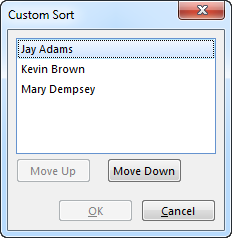
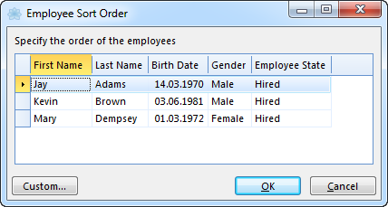

## Sort Objects

Use this effect to sort objects, and let the user sort objects interactively in tasks. This is useful, for example when a data source should be ordered after several read object effects, or when the user wants to control the order when merging or printing documents.

To sort objects, do the following.

1.  In the **Name** box, optionally type a name. The name is displayed in the action tree, if a name is not entered, a summary of the effect is displayed.
2.  In the **Description** box, optionally type a description.
3.  In the **Data Source** box, select the data source to sort. Only data sources of type **Object** with many occurences can be selected. In addition, it is not possible to select a data source that are used in an enumerator, if the effect is within the enumerator, since this would affect the sequence of iterations.  
    
4.  To specify which fields to sort the objects on, click **Sort by fields**. To add a field, click **Add**, and then click **[...]** to select a field. In the sort order column, select **Ascending** or **Descending** order for each field. To change the order of the fields, select the field in the list, and click **Move Up** or **Move Down**.
5.  To allow the user to sort the objects interactively, in the **User Interaction** section, select the **Promt user to sort objects** check box. If this option is enabled, the sorting specified above is presented as a default sorting which the user can accept or change.
6.  In the **Dialog Title** and **Dialog Prompt** box, type a title and a prompt. You can generate dynamic values for the title and prompt by [inserting fields from your data sources](../generate-dynamic-values-for-text-fields.md "Generate Dynamic Values for Text Fields").
7.  Select **Custom Sort**, if you want the user to move individual objects up or down in a list of objects. To the user this option looks like this:  
    
8.  Select **Table Sort**, if you want the user to sort objects in a table by clicking the appropriate column headers. The custom sort list is also available from the table, by clicking **Custom Sort**. To the user this option looks like this:  
    
9.  Click **Fields**, to specify the fields to be displayed in the dialog. It is recommended to include all the fields used for the initial sorting specified above. This option is only available if **Table Sort** is selected.
10.  Select the **Exit Task on cancel** check box if you do not want to execute suceeding effects if the user chooses the **Cancel** or **No** button in the dialog box.
11.  To store which button chosen by the user, click **Set a fields value equal to the exit code**. You can either store the response as a boolean value or an integer value. See the article [Dialog Box Exit Codes](../../../../../dialog-box-exit-codes.md "Dialog Box Exit Codes") for an overview of exit codes.
12.  Select which buttons that should appear in the dialog box.