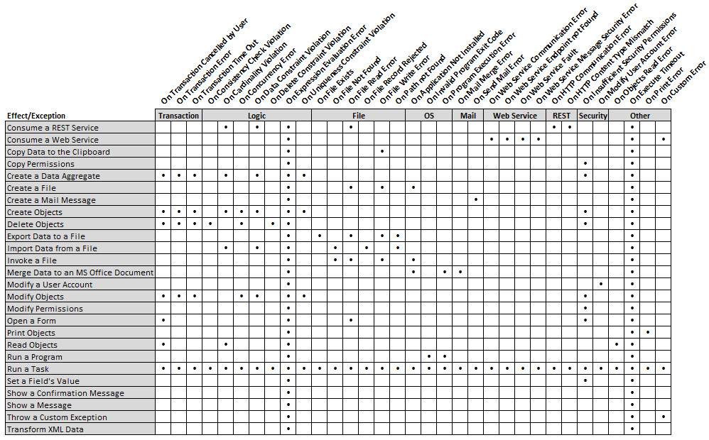

# Exception Handling

During execution of an action, there may occur errors that could result in a disruption of the normal execution flow. These errors are often referred to as exceptions, and can be handled by adding exception handlers to the action. [Catch Exception](actions/blocks/catch-exception.md) blocks are such exception handlers which are dedicated to resolving error situations, and are only executed if an error occurs.

There are different types of exceptions, and an exception handler can be defined to handle one or more of these types of exceptions. In an action there can be more than one exception handler for each type of exception, and when an exception occurs, the execution of the action will jump to the first relevant exception handler following the error. If the error occurs in a task which is called from a web service, an agent, a rule, or another task, the execution of the action will jump to the first relevant exception handler even if this is located outside the task itself.

Different types of exceptions can be thrown by the different effects. See the table below for details on which exceptions are thrown by which effects.

An exception handler is expected to handle the exception by correcting the error situation, or by cleaning up before exiting. If unable to handle the situation properly, the exception handler should throw the catched exception to signal that the exception needs to be handled further. This is especially useful when calling tasks, for example from other tasks.

The On Custom Error exception which is thrown by the [Throw Exception](actions/controls/throw-exception.md) effect, is used to control flow and errors your the business logic.

The On Expression Evaluation Error exception is thrown when there is an error in the evaluation of an [Advanced Expression](../../common-concepts/advanced-expressions.md) within an effect. For example if an expression attempts to retrieve the body of an XHtmlDocument where the XML is not valid. The exception is not thrown if the error is outside an effect, for example in the condition of an action.