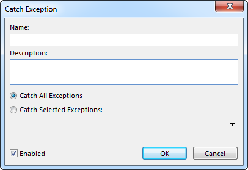

## Catch Exception

A catch exception block is executed when an error occurs, and contains actions to resolve such situations. Typically a catch exception block attempts to clean up and restore a consistent state. An action can contain several catch exception blocks, and each can handle different sets of exceptions. The catch exception block that is executed when an error occurs, is the first catch exception block that handles the specific exception type after the location of the error.

To handle complex error situations, the catch exception block is used in combination with effects, controls, and other blocks. See also these articles for information on [enumerating](enumerator.md) data sources, making [decisions](decision.md), [redirecting](../controls/redirect-execution.md) the execution flow, and [committing](scope.md) changes to data.  

An error can occur anywhere, also while cleaning up after another error within a catch exception block. In certain situations it may therefore be neccessary to have several catch exception blocks after one another, to handle more specific errors first, and then handle the less specif errors, should they occur. See [Exception Handling](../../exception-handling.md) for more information on exception handling, and the types of exceptions.

*   **Name**. The name is optional, and if there is no name, Catch Exception is displayed in the Action tree.
*   **Description**. The description is optional.
*   **Catch All Exceptions**. The catch exception block should be executed if any type of error occurs.
*   **Catch Selected Exceptions**. The catch exception block should only be executed if the error is among the selected [types](../../exception-handling.md).
*   **Enabled**. Default selected. Clear the check box to disable the catch exception block and all actions within it.