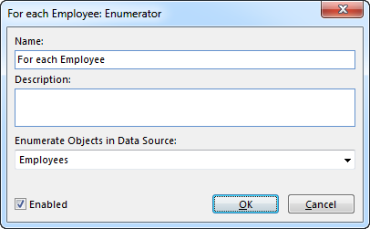

## Enumerator

An enumerator groups a set of actions and executes them several times, once per object in the data source that is enumerated. The data source to enumerate must be allowed to contain many objects. Within the enumerator, the data source will appear to allow only one object. Use enumerators within enumerators to go through all combinations of two or more data sources.  

To specify advanced operations, the scope is used in combination with effects, controls, and other blocks. See also these articles for information on making [decisions](decision.md), repeating operations in a [while loop](while-loop.md), [redirecting](../controls/redirect-execution.md) the execution flow, and [committing](scope.md) changes to data.

*   **Name**. The name is optional, and if there is no name, Enumerator (<data source>) is displayed in the Action tree.
*   **Description**. The description is optional.'
*   **Enumerate Objects in Data Sourece**. A data source with many objects to enumerate.
*   **Enabled**. Default selected. Clear the check box to disable the enumerator and all actions within it.