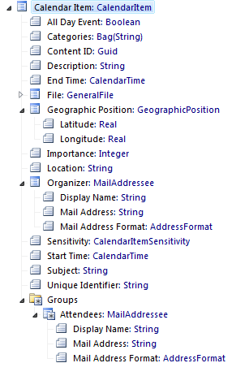
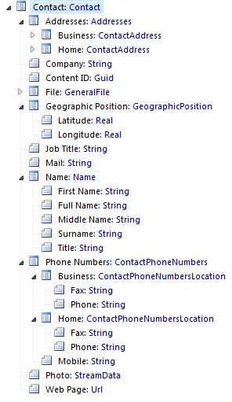
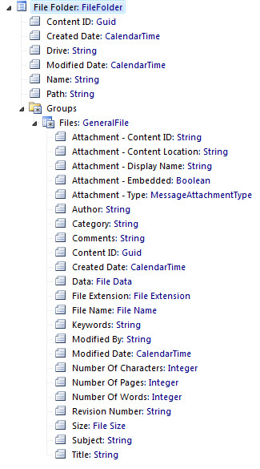

## File Data Sources

The File Data Sources are internal representations of external file formats. This enables the exchange of data through operations like import, export, copy, and paste. The supported File Data Sources are:

<table style="WIDTH: 100%">

<tbody>

<tr>

<th>Data Source</th>

<th>Format</th>

<th>Common File Extensions</th>

</tr>

<tr>

<td>Calendar Item</td>

<td>iCalendar</td>

<td>.ics, .ical, .icalendar, .ifb</td>

</tr>

<tr>

<td>Contact</td>

<td>vCard</td>

<td>.vcf, .vcard</td>

</tr>

<tr>

<td>File Folder</td>

<td></td>

<td>N/A</td>

</tr>

<tr>

<td>General File</td>

<td>Any format</td>

<td>.*</td>

</tr>

<tr>

<td>Mail Message</td>

<td>Outlook Item (only of type Message)</td>

<td>.msg</td>

</tr>

<tr>

<td>Microsoft Project</td>

<td>Microsoft Project</td>

<td>.mpp</td>

</tr>

</tbody>

</table>

For more information on the different types of File Data Sources explore the topics below:

## Calendar Item - iCalendar

The Calendar Item data source uses the iCalendar data format for representing and exchanging calendaring and scheduling information such as events, to-dos, journal entries, and free/busy information, independent of any particular calendar service or protocol.

A typical scenario for using an Calendar Item data source is to use it to receive data from a drag and drop operation from a calendar application, like Microsoft Outlook. The Calendar Item can then be used to create other objects containing some of the scheduling information. The other way around, an object can be dragged out of the application, and onto the calendar application to create an appointment there.

The groups Organizer and Attendees are populated when importing iCalendar, vCal, or Microsoft Outlook Appointment files. The groups are exported to iCalendar and vCal files. The structure of these groups are the same as sender, recipients, etc of the Mail Message file data source. The All Day Event property is not supported by vCal.

The File property represents the calendar item file itself.

For more information on the iCalendar standard see : [Internet Calendaring and Scheduling Core Object Specification (iCalendar)](http://tools.ietf.org/html/rfc5545)

## Contact - vCard

The Contact data source uses the vCard data format for representing and exchanging a variety of information about individuals and other entities, for example formatted and structured name and delivery addresses, email address, multiple telephone numbers, photo, logo, audio clips, etc.

The File property represents the vCard file itself.

The Photo property can be assigned to, or from, for example the picture property in a person object, or a general file.

## File Folder

The File Folder data source is used to represent a file system folder containing files. The File Folder data source

## General File

The General File data source represents a file system file, regardless of file format and file extension. The properties of the general file are therefore only the generic properties of the file system.

The general file is used for all types of file handling; for example reading or importing files, saving or exporting files, copy and paste operations, etc.

The Read Only attribute is not available in the meta-data for a file, but only as a file attribute in the file system. This means that the Read Only property will only be assigned a value if the data source is updated from a file (for example copy-paste operations, import from file, etc). In other cases the value is set to False.

## Mail Message

The Mail Message data source uses the Outlook Item format for representing and exchanging E-mail messages.

Typical scenarios are copy and paste of e-mail messages between the application and Microsoft Outlook, and sending e-mail messages manually directly from the application client or automatically from the application server.

The File property represents the Mail Message file itself.

## Microsoft Project

The File property represents the Microsoft Project file itself.