# Add a View

To add a view:

1.  In the **Form Description** area, click **Views**.
2.  In the Task Pane, click **Add Desktop View**.

For information on settings for the view, see [View Properties](view-properties.md). For more information on creating a layout, see [Layout Fundamentals](view-layout-fundamentals.md).

## Add a Control

There are two ways to add a control to a view;

*   Drag a control or a data source field from the task pane
*   Double-click a control or a data source field in the task pane

If you use a data source field to add a control, the default control for the field is added. Which control is the default control for a field, is determined by a combination of the data type and the data interpretation of the field. Some fields can provide an alternative to the default control by pressing **SHIFT** when adding the field. For example the default for a field referencing other objects is a Combo Box, but by pressing SHIFT while adding the field, a Search Box is added instead.

**Drag a control or data source field from the task pane**

1.  In the task pane header, click the down arrow.
2.  Select **Data Sources**, and then expand the data source to locate the field to add.  or  Select **Desktop Controls**, and then locate the control to add.
3.  Drag the item to the correct position in the layout.

While dragging the item, observe the layout for temporary placeholders, which indicates where the item will be positioned. For more information on dragging controls in the layout, see [Move a Control](add-a-view.md).

**Double-click a control or data source field in the task pane**

1.  [Select a control](add-a-view.md) in the layout, according to where you want to positin the new control.
2.  In the task pane header, click the down arrow.
3.  Select **Data Sources**, and then expand the data source to locate the field to add. or  
    Select **Desktop Controls**, and then locate the control to add.
4.  Double-click the control or field.

If you select a [container control](desktop-controls/containers.md), the new control is added as the last item in the group. If you select a non-container control, the new control is added immediately after the selected control.

## Move a Control

To move a control within the layout, a drag-and-drop operation is performed on the control. All controls can be moved, except the [group](desktop-controls/containers/group.md) control, which must temporarily be changed to a group box to be moved.

While dragging the control, observe the layout for temporary placeholders, which indicates where the control will be positioned.

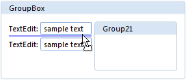 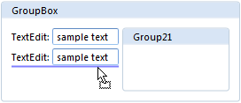

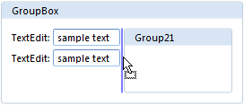 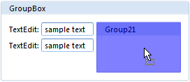

In complex layouts, it can sometimes be difficult to position controls precisely. In these cases it can be a good idea to save the form before the move operation, to make it possible to revert the operation. It is also possible to temporariliy change the alignment, size, or other properties of some controls, to make it easier to position the control you are moving correctly.

## Modify a Control's Properties <a name="modify-a-controls-properties"/>

To modify the properties of a control

*   [Select the control](add-a-view.md) you want to modify
*   Then in the Properties area, locate the property you want to modify.

For information on the properties of a control, see [Desktop Controls](desktop-controls.md), and find the article describing the specifi control.

## Select a Control

It is necessary to select a control to

*   [Modify it's properties](add-a-view.md).
*   Delete it.
*   [Add a control](add-a-view.md) inside it or next to it.

Different scenarios for selecting controls in the view are described in the table below.

To select                                         | Do the following
--------------------------------------------------|-------------------------------
Visible control                                   | Click the control.
Visible or non-visible parent of selected control | Press ESC once.
View                                              | Click a control, and then press ESC repeatedly to select the topmost parent, which is the view itself.

The figures below illustrate how parent controls are selected when a control is selected, and then ESC is pressed repeatedly until the view is selected.

<table style="WIDTH: 100%">
<tbody>

<tr>
<td>
Select control
</td>
<td>
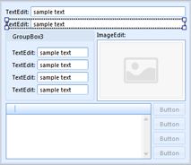
</td>
<td>
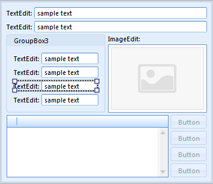
</td>
<td>
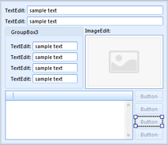
</td>
</tr>

<tr>
<td>
Then press ESC to select parent
</td>
<td>
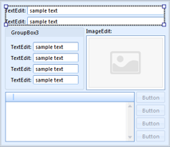
</td>
<td>
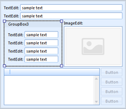
</td>
<td>
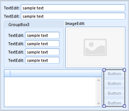
</td>
</tr>

<tr>
<td>
Then press ESC to select parent
</td>
<td>

</td>
<td>
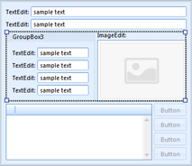
</td>
<td>
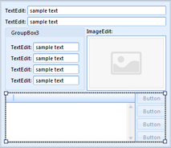
</td>
</tr>

<tr>
<td>
Then press ESC to select parent
</td>
<td>
</td>
<td>
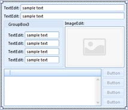
</td>
<td>

</td>
</tr>

</tbody>
</table>

## Browse the Control Hierarchy

The nature of the container controls, that they can contain one or more other controls, results in a hierarchy of controls. In many cases it can be difficult to get an overview of the structure of the controls, only by looking at the layout. The correct positioning of a control can also be challenging in a complex structure.

For this purpose it is possible to browse the control hierarchy as a folder structure, in the Control View. The container controls can be collapsed, or expanded to show the controls it contains. The structure can thereby easily be revised, and by selecting a control in the Control View, the control is also selected and displayed in the layout.

To display the control view, do the following:

1.  In the task pane header, click the down arrow.
2.  Select **Control View**.
3.  Then expand the nodes to browse the control hierarchy.

To see detailed information about the types of the controls, select the View Details check box.

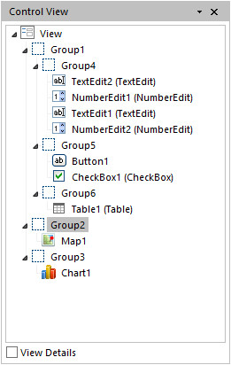

