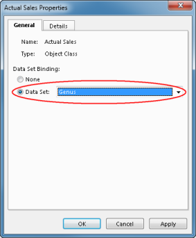

## Data Sets

A data set is a collection of data for a single unit of business. For example, many Enterprise Resource Planning (ERP) systems contains data for several companies. If the data are stored in different schemas or databases, you need to create a data set for each company.

Data sets in your directory are defined in [Genus Configuration](../../installation-and-configuration/configure-and-maintain-genus-server.md). This configuration covers settings such as where the data are located and which services that are provided.

Some settings, such as the default language for users, default text used in header and footers when distributing data can be changed using Genus Studio. Note that some objects in Genus Studio may be bound to a data set. See [Data Set Binding](data-sets.md) for more information.

### Specify a default language

Controls which language to use as the default for users of your application. The language can be changed in the personal setup for individual users.

Supported languages are **English (US)** and **Norwegian (Bokm&aring;l)**.

### Customize the default header and footer

Controls the default text used in the header and footer when distributing objects, for example, when a Report is sent to the printer or attached to a mail message.

To edit the text, click **Header and Footer**. Select an item or type a text in the left section, center section or right section. You can include items such as date, user, name of object, page number, total number of pages and data filter in the header or footer.

### Data Set binding

Some objects in Genus Directory may be bound to one or more data sets. If an object is bound to a data set, the object is only available for that data set.

By default the objects are not bound to a data set, ie. the objects are available in all data sets.

Among objects that may be bound to a data set are:

*   Object Class
*   Task
*   Agent
*   Web Service
*   Table
*   Report
*   Navigation Pane Item

To restrict access for an object to a specific data set, in Genus Studio:

1.  Right-click the object, and in the shortcut menu, click **Properties**.
2.  Click the **General** tab.
3.  In the **Data Set Binding** section, click **Data Set**, and then select a data set.

