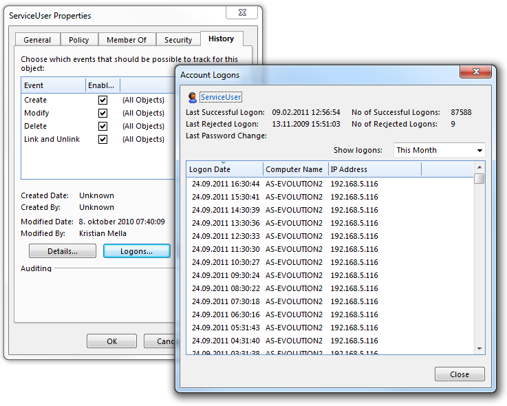

# Deleting log entries in the history

To control the growth of history, Genus Apps provides capabilities to define "retention rules" for history logs, like the sign in history, agent exeution history, and the event history, using the [Delete Objects](../defining-an-app-model/logic/action-orchestration/actions/effects/delete-objects.md) effect. The effect can be included in any action-based concept, such as an agent, a task, a web service, or a rule. One reason that the event history grows large is the logging of executed events for web services, agents and tasks. During development and testing you would often select the option **Save Detailed Execution Trace in History**, which may generate a large amount of data for each execution.

When establishing routines for deleting aged data from the history tables, one should take precautions to avoid performance penalties during the clean up. The main factor is the number of records deleted in each transaction, i.e. the number of records deleted by each Delete Objects effect. This can be controlled by adding more Delete Objects effects with a narrower scope by combining criterias like event types and period, and by increasing the frequencey at which the delete operations are run. The level of distribution across many delete object effects should be the result of an analysis of the frequency of logging.

Each instance of the effect is transformed into one DELETE command when executed. A DELETE command physically removes one row at the time and logs this in the transaction log. The transacction log is emptied at COMMIT, i.e. when the DELETE command has completed without fault. When deleting large amount of data from big tables, like the event history and sign in history, the transaction log will grow and result in IO performance degradation, and if the transaction log runs out of space, the command will fail and result in a ROLLBACK.

In most cases it will be neccessary to perform a manual cleanup of the history table before starting any automatic routines. Otherwise the first run will probably result in a major hang situation for the system, and at worst it will eventually fail. For example you can use the delete effect in a task to perform narrow and controlled delete operations before initiating automated delete operations, for example in an [agent](../defining-an-app-model/logic/agents.md). 

## Deleting the sign in history for accounts

Each time an account signs in, an entry is logged in the sign in history. The log entry contains information such as sign in date, computer name, and IP-address. Note that an audit trail refers to a log entry in the sign in history. If an entry is deleted, this information is lost. However, the audit trail also keeps track of the account which triggered an event, so the only information lost is the additional information stored in the log entry, such as computer name and IP-address.

For the account illustrated below, the sign in history contains 87,588 log entries (typically an account used when external clients are consuming web services). This account is probably a good candidate for reducing the size of the sign in history.

## Deleting the execution history for agents

Every time an agent runs, an agent execution log entry is created. It holds the status during execution, and becomes part of the history when the agent is finished. For agents enabled for detailed logging, the agent execution contains a detailed log of the execution. If the agent execution history is not deleted, over time it consumes a considerable amount of space in the database, especially for agents with a high frequency schedule, and agents with detailed logging.

## Deleting the event history for objects

Auditing is about accountability, and enables users to reconstruct and examine the sequence of events and/or changes in an event for an object. Although auditing is relatively inexpensive, you should limit the number of audited events as far as possible. Doing so minimizes the performance impact on the execution of audited statements and the size of the event history.
