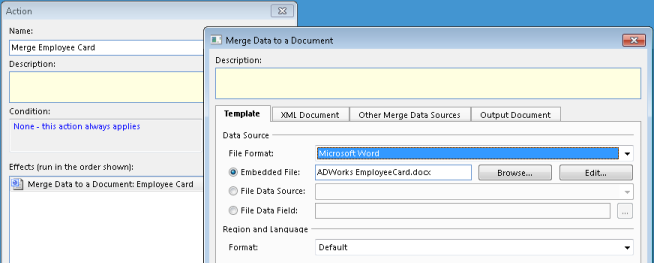
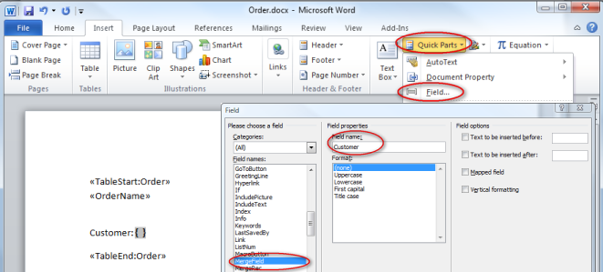
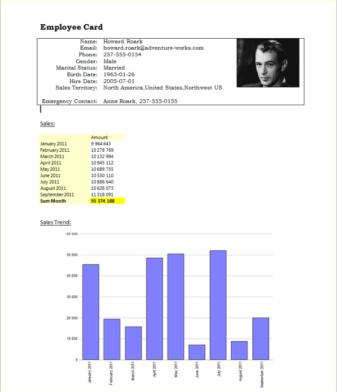
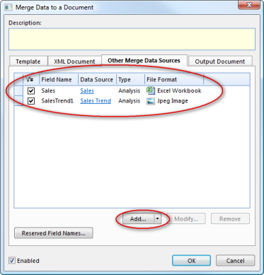
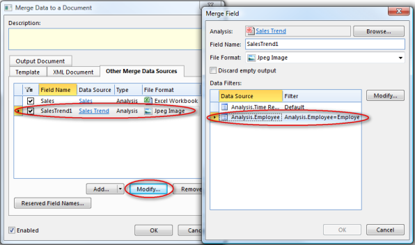
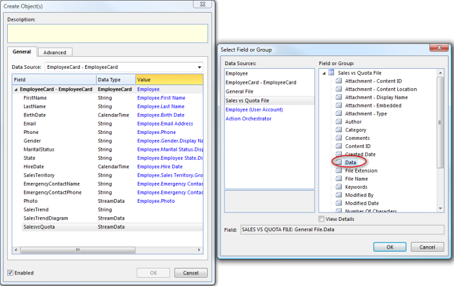
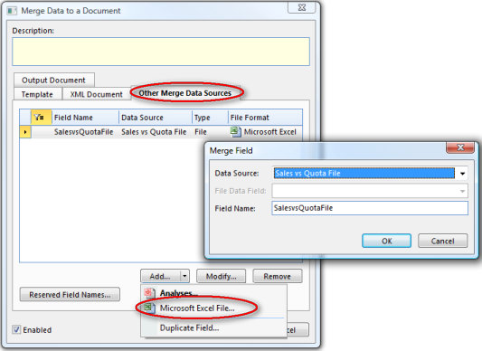

# Merge data to a Microsoft Word document

Mail Merge is a feature in Microsoft Word for quickly and easily creating documents such as letters, labels and envelopes. [The merge effect](../../defining-an-app-model/logic/action-orchestration/actions/effects/merge-data-to-a-document.md "The Merge Data to a Document Effect") extends the standard mail merge functionality and turns it into a full-fledged reporting solution, that allows you to generate complex documents such as reports, catalogs, inventories, and invoices.

The output of the mail merge operation is not confined to the Microsoft Word Document format. You can save the merged document to any of the following file formats:

*   Adobe Portable Document Format (PDF)
*   HTML
*   Microsoft Word (DOC, DOCX, DOCM)
*   Open Document Text (ODT)
*   Plain Text (TXT)
*   Rich Text Format (RTF)
*   XML Paper Specification (XPS)

## Basic steps

Follow these steps to perform a Word mail merge.

**Step 1.** Create [an XML Schema](../../defining-an-app-model/data/schemas.md "Schemas") defining the structure, content and semantics of the XML document used to provide data during the mail merge operation. If data are imported from an external source, you do not need to create an XML Schema. That is, the XML data can be imported directly into a General File data source.

**Step 2.** Use Microsoft Word to create and design a Word document called a **template**. Note that the document does not have to be a Microsoft Word Template (.dot/.dotx), it can be a normal document (.doc/.docx). Then you insert some special fields called **merge fields** into the template in places where you want to insert data from your data source.

**Step 3.** Add data sources which can hold the XML document, the template and the output document. The XML document can be [imported from file](../../defining-an-app-model/logic/action-orchestration/actions/effects/import-data.md "Import Data from a File"), or you can [create an XML document](../../defining-an-app-model/logic/action-orchestration/actions/effects/create-objects-and-modify-objects.md "Create Objects and Modify Objects") by assigning values from other data sources.

**Step 4.** In your Task, Web Service or Agent, include a merge effect describing which template to use, the data source containing the XML data, the data source where the merged document should be written to, and the file format for the merged document. See [here](../../defining-an-app-model/logic/action-orchestration/actions/effects/merge-data-to-a-document.md "The Merge Data to a Document Effect") for more information.

You can designate **repeatable merge regions** in the document or insert special merge fields that allow you to insert other content, such as images. Depending on how you set up mail merge fields and repeatable regions inside the document, the document will grow to accommodate multiple objects in your data source. Using repeatable mail merge regions, you can designate portions inside a document that will be repeated for each object in the data source. E.g., if you mark a table row as a repeatable region, the row will be repeated for each object in the data source, causing the table to dynamically grow to accommodate all of your data.

## Merge fields

Merge fields are used as placeholders for data that are inserted during a mail merge operation. A merge field is composed of **field codes** and **field switches**.

Field codes appear between curly brackets, or braces ( **{ }** ), and is a placeholder text that show where specified information from your data source will appear. The field code includes the field characters, field type, and instructions.

A switch is a special instruction that when placed in a field causes a specific action to occur. For example, inserting the \*Caps switch into a field specifies that the first letter of each word in the field result is capitalized.

Example:

**{** MERGEFIELD Responsible \b Contact: \* Upper **}**

**MERGEFIELD** is the field name

****Responsible**** is the text for the required instruction Field Name. The field name represents an element in your XML document.

**\b** is an optional switch for the text that precedes the field result (Contact).

**\* Upper** is an optional switch to specify that the name is displayed in all capitals.

If the value for the Responsible element in the XML document is Dagny Taggart, the field result would be

Contact: DAGNY TAGGART

You can switch between field names and field codes using the keyboard shortcut Alt+F9.

## Special field codes

The merge effect introduces a set of special field codes which takes the standard mail merge and advances it many steps ahead. The codes are included in the required instruction **Field Name** of a merge field, suffixed with a colon. For example, to insert an image located in an element named Photo, the **Field Name** would be

Image:Photo

**Image:** is the special field code which instructs the effect to insert an image.

**Photo** is the name of the element in the XML document holding the image.

Some field codes requires a matching pair of merge fields to mark the beginning and end of an instruction. For example, to mark the beginning of a mail merge region, insert a merge field with the name TableStart:element-name, where element-name corresponds to a complex type element in your XML document. To mark the end of the mail merge region, insert another merge field with the name TableEnd:<element-name>.

The table below summarizes available field codes:

<table style="WIDTH: 100%">

<tbody>

<tr>

<th>Field Code</th>

<th>Description</th>

</tr>

<tr>

<td>

**HideIfEmptyStart:**element-name

**HideIfEmptyEnd:**element-name

</td>

<td>

Hides all document content that is included inside these two merge fields if the value for the element given by element-name is blank. If these merge fields are placed in different cells in a MS Word table, the entire row is hidden.

An alternative can be to use the standard merge field switches to add text before or after non-empty merge fields:

Insert text before merged data if not empty: { MERGEFIELD Title \b bTitle: b }  
Insert text after merged data if not empty: { MERGEFIELD Title \f b (Book title)b }

</td>

</tr>

<tr>

<td>**Html:**element-name</td>

<td>Inserts a report located in the element given by element-name. The file format for the report must be set to Microsoft Word HTML Table. For graphs use the image Field Code.</td>

</tr>

<tr>

<td>**Rtf**:element-name</td>

<td>Inserts Rtf-encoded text located in the element given by element_name. The data type of the schema element is typically Base64Binary.</td>

</tr>

<tr>

<td>**Image:**element-name</td>

<td>

Inserts an image located in the element given by element-name. To adjust the size for the image, place the merge field inside a single-cell table or a text box, and then set the preferred size for the cell or text box. The image will resize to fit the size of the cell or text box, without changing its aspect ratio.

The image field code must be used when [merging reports](merge-data-to-a-microsoft-word-document.md).

</td>

</tr>

<tr>

<td>**XL:**element-name</td>

<td>Inserts a report or an Excel file as table located in the element given by element-name. The file format for the report or the file must be set to Microsoft Excel File.</td>

</tr>

<tr>

<td>**MinNoOfRows:**no-of-rows</td>

<td>

Adds rows to a table if it contains less rows than the minimum number of rows. The merge field has to be placed in the paragraph before the table. Empty tables are automatically removed when merging data, unless the **MinNoOfRows:** is included in the paragraph before the table.

Example:

<table style="WIDTH: 100%">

<tbody>

<tr>

<td>

<<**MinNoOfRows:**5>>

<table style="WIDTH: 100%">

<tbody>

<tr>

<th>Title</th>

<th>Price</th>

</tr>

<tr>

<td><<**TableStart:**Book>><<Title>></td>

<td><<Price>><<**TableEnd:**Book>></td>

</tr>

</tbody>

</table>

</td>

</tr>

</tbody>

</table>

</td>

</tr>

<tr>

<td>

**NoBreakStart:**[(delimiter-string)]

**NoBreakEnd:**[(end-string)]

</td>

<td>

Keeps a repeating region in the same paragraph. The optional delimiter-string is inserted between the regions, and the optional end-stringis added at the end of the list

Example:

<table style="WIDTH: 100%">

<tbody>

<tr>

<td>

<<**NoBreakStart:(, )**>>

Books:

<<**TableStart:**Book>><<Title>><<**TableEnd:**Book>>

<<**NoBreakEnd:(.)**>>

</td>

</tr>

</tbody>

</table>

Output:

<table style="WIDTH: 100%">

<tbody>

<tr>

<td>

Books: Title-1, Title-2, Title-3.

</td>

</tr>

</tbody>

</table>

Note that if the text Books: is placed in the same paragraph as <<TableStart:Book>>, it is repeated once for each book, such as:

<table style="WIDTH: 100%">

<tbody>

<tr>

<td>

Books: Title-1

Books: Title-2

Books: Title-3

</td>

</tr>

</tbody>

</table>

These field codes should not be located in the same paragraph as **TableSt****art:** or **T****ableEnd:**.

</td>

</tr>

<tr>

<td>**PageBreakBefore:**</td>

<td>

Inserts a page break if necessary, i.e. if not already on new page, which is often the case for the first page. Used when a page break needs to be inserted between repeated regions. Inserting a regular page break will cause the mail merge to fail.

Example:

<table style="WIDTH: 100%">

<tbody>

<tr>

<td>

<<**TableStart:**Book>><<**PageBreakBefore:**>><<Title>><<**TableEnd:**Book>>

</td>

</tr>

</tbody>

</table>

This ensures that the Title always starts on a new page.

</td>

</tr>

<tr>

<td>

**ShowIfEmptyStart:**element-name

**ShowifEmptyEnd:**element-name

</td>

<td>Shows all document content that is included inside these two merge fields if the value for the element given by element-name is blank.</td>

</tr>

<tr>

<td>

**TableStart:**element-name

**TableEnd:**element-name

</td>

<td>

Repeats all document content that is included inside these two merge fields for every occurrence of the complex type element given by element-name.

Example 1:

<table style="WIDTH: 100%">

<tbody>

<tr>

<td>

<<**TableStart:**Book>><<Title>><<**TableEnd:**Book>>

</td>

</tr>

</tbody>

</table>

Output:

<table style="WIDTH: 100%">

<tbody>

<tr>

<td>

Title 1

Titel 2

Title 3

</td>

</tr>

</tbody>

</table>

Example 2:

<table style="WIDTH: 100%">

<tbody>

<tr>

<td>

<table style="WIDTH: 100%">

<tbody>

<tr>

<th>Title</th>

<th>Price</th>

</tr>

<tr>

<td><<**TableStart:**Book>><<Title>></td>

<td><<Price>><<**TableEnd:**Book>></td>

</tr>

</tbody>

</table>

</td>

</tr>

</tbody>

</table>

Output:

<table style="WIDTH: 100%">

<tbody>

<tr>

<td>

<table style="WIDTH: 100%">

<tbody>

<tr>

<th>

Title

</th>

<th>Price</th>

</tr>

<tr>

<td>Title 1</td>

<td>9.99</td>

</tr>

<tr>

<td>Title 2</td>

<td>8.99</td>

</tr>

<tr>

<td>Title 3</td>

<td>7.99</td>

</tr>

</tbody>

</table>

</td>

</tr>

</tbody>

</table>

Note that an empty single paragraph at the beginning of a repeating region is automatically removed to avoid unwanted blank lines. To keep an empty paragraph, insert a space (or any other character) in the paragraph.

</td>

</tr>

<tr>

<td>**URL:**element-name</td>

<td>Inserts an URL located in the field given by element-name.</td>

</tr>

</tbody>

</table>

## Merge field formatting

If you want to format merged data, you need to format merge fields in the document as appropriate.

**Change Text Formatting** *   In the template, select the field that contains the information you want to format, including the surrounding merge field characters ( << >>).
*   On the **Format** menu, click a command, such as **Font** or **Paragraph**, and select the desired options. 

*   In the template, select the field that contains the information you want to format, including the surrounding merge field characters ( << >>).
*   On the **Format** menu, click a command, such as **Font** or **Paragraph**, and select the desired options.

**Using Field Switches to Specify Formatting**

Microsoft Word supports switches that control how numbers and dates are formatted. In Microsoft Word, press Alt+F9 to display fields codes in the template, and then add switches to the merge fields.

Examples:

*   To display the number "34987.89" as "b,34,987.89", add the numeric picture switch **\# "b,#,###.00"**.
*   To display the number "0945" as "9:45 PM", add the date/time picture switch **\@ "h:mm am/pm"**.

You can control the number and date format used during the mail merge operation. That is, if you add a numeric picture switch including space as the digit grouping symbol and comma as the decimal separator, you should ensure that numeric data are interpreted according to the switch. To do this, in the **Number and Date Format** box in the effect setup, select which language settings to use.

Note that the format settings are based on the default settings for the selected language, and is independent of the settings specified in the Windows locale (the set of user preference information related to the user's language, environment and/or cultural conventions).

To ensure that the merged information has the same font and point size you apply to the merge field, add the **\* MERGEFORMAT** switch. See the article [http://office.microsoft.com/en-us/word-help/CH006104723.aspx](http://office.microsoft.com/en-us/word-help/CH006104723.aspx) to obtain more details about field switches.

## Preparing your template

In order to prepare your template to perform a simple mail merge, you need to specify a mail merge region for all merge fields within the template. The mail merge region is required even if the data source contains only one object. The name of the region corresponds to the name of a top-level element in the XML document representing a complex type. Between these marking fields, place merge fields that corresponds to simple type elements in the XML document located below the complex type element.

To mark the beginning of a mail merge region, insert a merge field with the name TableStart:element-name. To mark the end of the mail merge region, insert another merge field with the name TableEnd:<element-name>.

To insert merge fields, do the following:

1.  On the **Insert** tab, click **Quick Parts**, and then click **Field**.
2.  Select MergeField in **Categories** list, and enter the field name

In the example below, data are merged for a single order:

<table style="WIDTH: 100%">

<tbody>

<tr>

<td>

<<**TableStart:**Order>>

**<<Order Name>>**

Customer: <<Customer>>

Date: <<Date>>

Total Amount: <<Total Amount>>

<<**TableEnd:**Order>>

</td>

</tr>

</tbody>

</table>

and the output would look like this:

<table style="WIDTH: 100%">

<tbody>

<tr>

<td>

**Order #1**

Customer: Taggart Transcontinental

Date: 12\. February 2010

Total Amount: b,4,500.00

</td>

</tr>

</tbody>

</table>

If the XML document contains more than one occurrence of the element, all document content that is included inside the mail merge region is automatically repeated for every element in the XML document.

If the XML document in the example above contained multiple orders, the output would look like this:

<table style="WIDTH: 100%">

<tbody>

<tr>

<td>

**Order #1**

Customer: Taggart Transcontinental

Date: 12\. February 2010

Total Amount: b,4,500.00

**Order #2**

Customer: Rearden Metal

Date: 15\. February 2010

Total Amount: b,6,300.00

</td>

</tr>

</tbody>

</table>

To list the orders in a Word table, you would place a TableStart and TableEnd inside the same row of the table:

<table style="WIDTH: 100%">

<tbody>

<tr>

<td>

<table style="WIDTH: 100%">

<tbody>

<tr>

<th>Order</th>

<th>Customer</th>

<th>Date</th>

<th>Total Amount</th>

</tr>

<tr>

<td><<**TableStart:**Order>><<Order Name>></td>

<td><<Customer>></td>

<td><<Date>></td>

<td>

<<Total Amount>><<**TableEnd:**Order>>

</td>

</tr>

</tbody>

</table>

</td>

</tr>

</tbody>

</table>

Output:

<table style="WIDTH: 100%">

<tbody>

<tr>

<td>

<table style="WIDTH: 100%">

<tbody>

<tr>

<th>Order</th>

<th>Customer</th>

<th>Date</th>

<th>Total Amount</th>

</tr>

<tr>

<td>Order #1</td>

<td>Taggart Transcontinental</td>

<td>12\. February 2010</td>

<td>

b,4,500.00

</td>

</tr>

<tr>

<td>Order #2</td>

<td>Rearden Metal</td>

<td>15\. February 2010</td>

<td>b,6,300.00</td>

</tr>

</tbody>

</table>

</td>

</tr>

</tbody>

</table>

When marking a region, follow these rules:

*   TableStart and TableEnd fields must be inside the same section in the document.
*   If used inside a table, TableStart and TableEnd must be inside the same row in the table.
*   Mail merge regions can be nested inside each other.
*   Mail merge regions should be well formed, that is, there is always a matching TableStart and TableEnd with the same element name.

**Nested mail merge regions**

Most data in relation databases are hierarchical, such as an invoice or order containing multiple items. The merge effect allows nesting mail merge regions inside each other in a document to reflect the way the data is nested.

Nested mail merge regions are at least two regions in which one is defined entirely inside the other. In a document it looks like this:

<table style="WIDTH: 100%">

<tbody>

<tr>

<td>

<<**TableStart:**Order>>

<<**TableStart:**Item>>

<<**TableEnd:** Item>>

<<**TableEnd:**Order>>

</td>

</tr>

</tbody>

</table>

or

<table style="WIDTH: 100%">

<tbody>

<tr>

<td>

{ MERGEFIELD **TableStart:**Order }

{ MERGEFIELD **TableStart:**Item }

{ MERGEFIELD **TableEnd:** Item }

{ MERGEFIELD **TableEnd:**Order }

</td>

</tr>

</tbody>

</table>

Just as in standard mail merge, each region contains data from one complex element in your XML document. What's different in nested mail merge is that the **Order** region has the **Item** region nested inside it. This makes the **Order** region the parent, and the **Item** region the child. When data are merged, the regions act just like a parent-child relationship, where data for each **Order** are linked to one or more **Item** elements.

Even if the data is hierarchical, it is possible to list the child items directly by omitting mergefields for the parent. In a document it looks like this:

<table style="WIDTH: 100%">

<tbody>

<tr>

<td>

<<**TableStart:**Item>>

<<**TableEnd:** Item>>

</td>

</tr>

</tbody>

</table>

or

<table style="WIDTH: 100%">

<tbody>

<tr>

<td>

{ MERGEFIELD **TableStart:**Item }

{ MERGEFIELD **TableEnd:** Item }

</td>

</tr>

</tbody>

</table>

**Repeating Data Horizontally in a Table**

To repeat data horizontally in a table with a defined number of columns use the following construction:

<table style="WIDTH: 100%">

<tbody>

<tr>

<td>

<table style="WIDTH: 100%">

<tbody>

<tr>

<th>

Items

</th>

<th></th>

<th></th>

</tr>

<tr>

<td>

<<**TableStart:**Item>>

<<Item>>

</td>

<td>{NEXT}<<Item>></td>

<td>{NEXT}<<Item>><<**TableEnd****:**Item>></td>

</tr>

</tbody>

</table>

</td>

</tr>

</tbody>

</table>

The output would then lok like this

<table style="WIDTH: 100%">

<tbody>

<tr>

<td>

<table style="WIDTH: 100%">

<tbody>

<tr>

<th>

Items

</th>

<th></th>

<th></th>

</tr>

<tr>

<td>

Hawaiian Pizza

</td>

<td>Fries</td>

<td>Chicken Wings</td>

</tr>

<tr>

<td>BBQ Pizza</td>

<td>1.5L Coke</td>

<td></td>

</tr>

</tbody>

</table>

</td>

</tr>

</tbody>

</table>

The {NEXT} field, which is a not a merge field but just a regular field, can be inserted by pressing CTRL+F9\. Toggle field codes by pressing SHIFT+F9 to view the field codes.

**Repeating Data Horizontally without a Table**

Simple horizontally repeated lists can easily be merged, as described for the field codes **NoBreakStart:** and **NoBreakEnd:**. However, for more complex data, and for images, a more advanced construction is probably better. Such as this:

<table style="WIDTH: 100%">

<tbody>

<tr>

<td>

<<**NoBreakStart:**>>

<<**TableStart:**Product>>

<table style="WIDTH: 100%">

<tbody>

<tr>

<td>

Text Box with wrapping in line with text

<table style="WIDTH: 100%">

<tbody>

<tr>

<td>

Table with two rows

<<**Image:**ProductImage>>

</td>

</tr>

<tr>

<td><<ProductName>></td>

</tr>

</tbody>

</table>

</td>

</tr>

</tbody>

</table>

<<**TableEnd:**Product>>

<<**NoBreakEnd:**>>

</td>

</tr>

</tbody>

</table>

Apply the neccessary formatting to the text box and table borders to achieve the desired result. By setting the width and height for the image cell the image size will be restricted, and a smart setting will allow for all images to be the same width or the same height.

## Merging reports

Reports may be included in your mail merge, like the **Sales** and **Sales Trend** report included in the **Employee Card** shown  below.

To include reports in your mail merge, click the **Other Merge Data Sources** tab, and then click the **Add** button.

You must specify a **Field Name** for each report. Insert merge fields in your template and use the **Field Name** to refer to your report, using the [special field codes](merge-data-to-a-microsoft-word-document.md).

Note that the **Field Name** does not need to be defined as an element in your XML schema. This means that the XML schemas used for merging can be restricted to business data, while reports and filtering of these are maintained as part of the merge operation set up. Click the **Reserved Field Names** button to see which field names are used in the schema and therefore cannot be used as a report field name.

To set the data filters, select a report and click the **Modify** button. In the **Merge Field** dialog box, select a data source and click the **Modify** button to specify the filter.

In the **Merge Field** dialog box you may also change the **Field Name** and select the **File Format**.

Select the **Discard empty output** check box if the report should not be merged into the document unless it contains any data. E.g. to avoid merging an empty bar chart into the document. You may combine this with the special field codes **HideIfEmptyStart**, **HideIfEmptyEnd**, **ShowIfEmptyStart**, and **ShowIfEmptyEnd** to control the content of your document in more detail.

**Note!** Changes to which reports are included and their data filters, do not require a deployment of the app model, since selected end users may modify this set up.

**Hide Filter Area in merged reports**

1.  On **File** menu in your report, click **Page Setup**, and then click **Content** tab.
2.  In the **Filter Area** list, select **Not Visible**.

**Modify access for selected end users**

You may allow selected end users to modify which reports are included in the mail merge and how these reports are filtered. To grant an end user such access, the following requirements must be fulfilled:

*   The user must have **Modify** permissions to your merge task. See [Security and Privacy](../../defining-an-app-model/security/index.md) for more information.
*   In your task setup, on the **General** tab, select the **Enable Modify by Users without Version Deployment** check box.

The end user may modify the task from the Actions Pane, or from Genus Studio. See [Modify Merging of Reports](../../../users/navigate-view-modify-and-control/running-actions/modify-merging-of-reports.md) for more information.

## Merging Microsoft Excel files

Microsoft Excel files may be included as tables in your mail merge. You have to define Excel file as an element in the XML schema. The element has to be of the type base64Binary. When provide data to the XML file from a General File by using Create/Modify Objects, you have to use the field Data.

Alternatively you can add files directly in the task **Merge Data to a Document**.

1.  Select **Other Merge Data Sources** tab.
2.  On the **Add** button, click  , and then click **Microsoft Excel File**.
3.  Select a **Data Source** which you have imported your data in Microsoft Excel file to, and type the name of the field in **Field Name**.

You must specify a Field Name for each file. Insert merge fields in your template and use the **Field Name** to refer to your file, using the [special field codes](merge-data-to-a-microsoft-word-document.md "Special Field Codes") **XL**.

Example:  
{MERGEFIELD XL:SalesvsQuotaFile \*MERGEFORMAT}

