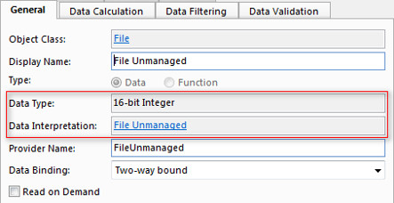

# Upload and download large files

Genus Apps supports upload and download of large files, in the tens to hundreds of megabytes order, using standard HTTP POST and HTTP GET mechanisms. Some of the advantages to uploading/downloading are, that it is more resource efficient, and that it is easier to cancel an ongoing operation.

## Uploading a file

Uploading is supported by the effect **Upload a File**. The file can be uploaded to a new or an existing object. There are certain required special properties for the data source to upload files to. For more information, see [Upload a File](../defining-an-app-model/logic/action-orchestration/actions/effects/upload-a-file.md).

## Downloading a file

To allow a file to be downloaded using this mechanism, the object class is required to have a property with data interpretation File Unmanaged, and the value of this property must be TRUE. You would typically set this value to TRUE in the default values setup in the File Upload effect. The unmanaged flag can also be set based on logic which marks a file as unmanaged if the size exceeds a certain limit.

Whenever a file is accessed by a user, e.g. when invoked from a Grid control, or saved to file, the file is automatically downloaded given that the file is marked as unmanaged. The File Preview control handles unmanaged files by displaying a link which can be clicked to download the file.  

Note that when a file is downloaded, the file is opened as read only and cannot be edited by the user.  

## Special considerations

If you plan to extend your usage of Genus Apps to handle large files, remember to check your database free space and growth settings. E.g. pay attention to settings like Database files Autogrowth in Microsoft SQL Server.
