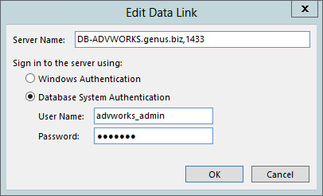

# Edit Data Link

A data link specifies a connection between your Genus Services application server and your database server. The data link specification depends on your database system.

## Oracle

In the **Server Name** box, enter a net service name or an Oracle Data Provider connection string.

A net service name must map to a "connect descriptor" described in the _tnsnames.ora_ file. This file normally resides in the _Oracle home\network\admin_ folder. The contents of a _tnsnames.ora_ file may look like the example below. Replace _yourserver_, _yourport_ and _yourservicename_ with your environment's data. Refer to your Oracle documentation for more information.

```text
# tnsnames.ora Network Configuration File: D:\Oracle\product\11.2.0\dbhome_1\NETWORK\ADMIN\tnsnames.ora  
# Generated by Oracle configuration tools.

Connection1 =  
(DESCRIPTION =  
(ADDRESS_LIST =  
(ADDRESS = (PROTOCOL = TCP)(HOST = yourserver)(PORT = yourport))  
)  
(CONNECT_DATA =  
(SERVER = DEDICATED)  
(SERVICE_NAME = yourservicename)  
)  
)
```

If you specify an Oracle Data Provider connection string, the following example contains the minimum of information required: _(DESCRIPTION=(ADDRESS_LIST=(ADDRESS=(PROTOCOL=TCP)(HOST=yourhost)(PORT=yourport)))(CONNECT_DATA=(SERVICE_NAME = yourservicename)))_. Replace _yourhost_, _yourport_ and _yourservicename_ with your environment's data.

In the **Sign in to the server using** section, select **Database System Authentication** for Oracle. In the **User Name** box enter the database user. In the **Password** box, enter the database user password.

## Microsoft SQL Server

In the **Server Name** box, enter the name of the database server, and optionally a port number separated by a comma.

In the **Sign in to the server using** section, select either **Windows Authentication** or **Database System Authentication**.

*   **Windows Authentication:** The current user will be used when connecting to the database.
*   **Database System Authentication:** In the **User Name** box, enter the database user. In the **Password** box, enter the database user password.



## Sybase

In the **Server Name** box, enter the name of the database server.

In the **Sign in to the server using** section, select either **Windows Authentication** or **Database System** **** ****Authentication****.

*   **Windows Authentication:** The current user will be used when connecting to the database.
*   **Database System Authenticaion:** In the **User Name** box, enter the database user. In the **Password** box, enter the database user password.