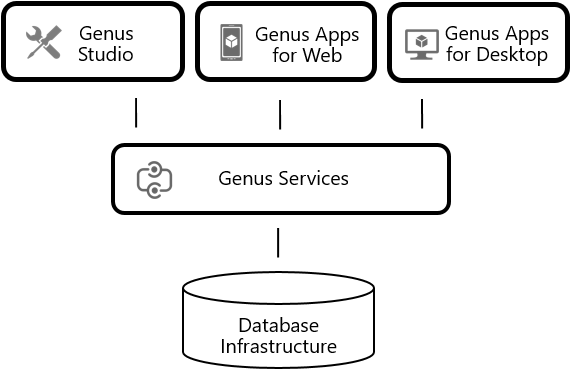

# Architecture

Genus Studio is the Microsoft Windows desktop client used by developers for defining an Genus app model. The app model is stored in a database of your choice on the database infrastructure layer.

Genus for desktop is the end user client for Microsoft Windows, interpreting your app model at run time.

Genus for web is the end user client for web browsers, also interpreting your app model at run time.

The app model interpretation does not result in any performance penalty. Rather, knowledge about data (knowledge contained in the app model) is used as input in our optimizers, resulting in improved performance compared to traditional programmed or packaged applications.

Genus Studio, Genus for web, and Genus for desktop communicates with Genus Services using the protocols http or https on ports 80 or 443.

Genus Services manages connectivity to the database layer and offer services to the Genus clients, i.e. Genus Studio, Genus for web and Genus for desktop. Modeled services interpret your app model at run time.

All Genus Services are multi-threaded, thereby allowing you to scale your Genus Services vertically (scale up), i.e. utilize more memory and CPUs on your server or node.

All services are stateless, providing resilience at the Genus Services tier, meaning that several Genus Services can be clustered using Microsoft Network Load Balancing Technology (or similar), allowing you to scale horizontally (scale out), i.e. adding more servers or nodes to your Genus app.

Genus Services may be placed on-premises at your business' location, at a third party hosting service provider, in Microsoft Azure or any other cloud provider.

For more information, see our white paper [Genus Apps - A Technology Overview](media/Genus-Apps-A-Technology-Overview-White-paper.pdf).
