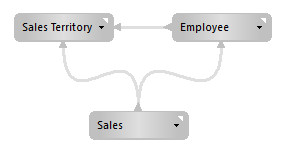
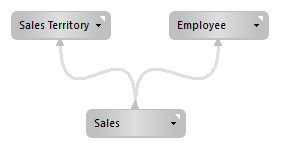
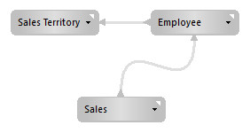

# Data mart concepts

  **The main idea of the data mart is to simplify access to enterprise data, for different purposes and users, by reducing data complexity and volume. An application model will typically have several data marts, each of which serves a specific and focused purpose for a group of users, through Analyses and Data Extracts.**

The main steps when creating a data mart includes:

*   Add data sources and specify data filters.
*   Publish fields for the data sources.
*   Define connections between data sources.
*   Add any local fields or data sources to enrich the data mart.

When designing a data mart there are many considerations to make, and some of these topics are briefly discussed below.

**Data Sources and Fields**

The data mart reduces the data volume by defining a subset of the data in the application. Only the data sources and fields that are relevant to the purpose of the data mart are added. For example; in a data mart focusing on sales we only add data sources for sales representatives, product hierarchies, and actual sales with fields like names, amounts and dates. In addition, data filters are defined for the data sources to include only data that is relevant. For example; only sales for the last 12 months for a specific product category.

The fact that only relevant data sources, fields, and data are included in the data mart does not only reduce the data volume, but also the complexity.

When a data mart is initiated, the entire subset of data is loaded into memory, even if every part of the mart is not used every time. This data load requires resources on the server, network, and client computer. The size of the data mart is therefore an important consideration. Try to make the data marts as focused and small as possible while still fulfulling their purpose. Consider splitting data marts that serve more than one purpose, into several smaller ones.

**Connections**

The complexity is reduced, not only indirectly by reducing the data volume, but more importantly by explicitly specifying which connections to use between data sources. In enterprise data there are very often many connections available between two data sources. For example; an invoice is connected to the month data source through the invoice date, the due date, and the payment received date fields.**** 

In the application model a connection between two object classes means that one object class has a a reference to the other object class, or one object class has a property that can contain values from the other object class. For objects in the data sources

In a data mart, connections are used to propagate selections. When two objects in two different data sources are connected, and one of them is selected, the other is automatically qualified. When two objects in two different data sources are not connected, and one of them is selected, the other is automatically disqualified or excluded.

**Connections to Calendar Data Sources**  

Connections from a data source to a calendar data source, for example month, does not use a corresponding month reference field in the data source, but instead a date field is used. When connecting more than one calendar data source it is not possible to use the same date field all of them. In this case, for example connecting day and month, the data source would be connected to the day data source, which again would be connected to the month data source, creating a hierarchy. This is, however, not possible for some calendar data sources, like week and month. In this case the data source must provide an extra date field to connect to the other calendar data source. Luckily, the extra date field can be added as a supplement within the data mart.

**Multiple Data Sources of the Same Type**

The fact that connections are used to propagate selections, can sometimes lead to undesired effects. For example, consider a case where the Month data source is connected to both Invoice.DueDate and Sales.Date. When a month is selected, the invoices that are due that month are qualified, and the sales transactions performed that month are qualified. Unfortunately sales performed at the end of one month will often be invoiced with a due date the month after, which can lead to inconsistent data.

This is fortunately easily solved, by adding the month data source twice, and connecting them to one of the other data sources each. This way a selection of an invoice due month will not affect the sales month, and vice versa. Remember to rename the data sources to ensure unambiguous names and avoid misunderstandings.

**Model Structure**

**Data Filter Dependencies**

Data filters for data sources in Forms, Tables, or Action Orchestration often refer to other data sources, for example, invoice.Customer is any of company. This works fine in the previously mentioned contexts, but should be avoided for data marts deployed to desktop clients. This is because part of the data filter evaluation is performed on the client, and this construction results in unecessary large amounts of data being transferred between the server and the client.

 **Circular References**

To avoid complexity and performance degradation, circular references within a data mart are not allowed. A circular reference exists if there are two or more paths between two data sources. There are many different scenarios where this can occur, and similarly many approaches how to

resolve the circular reference. Consider the following cases:

 <table style="WIDTH: 100%">

<tbody>

<tr>

<th>Example</th>

<th>Possible Solution</th>

</tr>

<tr>

<td valign="top">

The Invoice data source has connections to the Month data source both through Invoice.DueDate and Invoice.PaymentReceivedDate.

</td>

<td valign="top">

Add two Month data sources, name them Due Month and Payment Received Month, and connect each of them to the Invoice data source using the appropriate field.

</td>

</tr>

<tr>

<td valign="top">

The data sources Sales and Budget both have connections to Month and Product.

</td>

<td valign="top">

The data mart offers functionality to create a Link Table data source. A link table has the ability to create objects with references of all combinations to several data sources. The link table thereby provides a representation of the combination of two or more other data sources which can be referenced through one connection.

</td>

</tr>

<tr>

<td valign="top">

The data source Employee has a connection to Sales Territory which specifies which sales territory a sales employee belongs to. A Sale contains information on which Sales Territory and which Employee it belongs to.

</td>

<td valign="top">

Consider if some of this information is redundant, and remove one of the connections. In this case, one of the following approaches is probably most useful.

</td>

</tr>

</tbody>

</table>