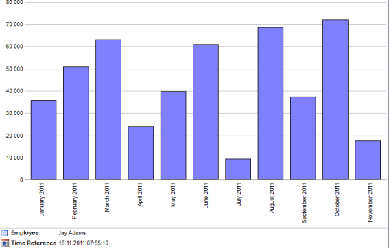

# Report

A Report offers powerful functionality to create multidimensional and aggregated reports based on your data.

Genus offers several functions in a way that makes it easy to create a dynamic Report. A report contains one or more values that are aggregated over a set of dimensions or objects. Example the value amount aggregated over the object Employee. A Report also support many type of chart to help you display data in ways that are meaningful.

Reports can be published as shortcut in Navigation Pane, or published to a table. A published report may contain data filters and functions that allow user to change what data to include.  

**Topics in "Report"**
* [The Workface](the-workface.md)
* [Values](values.md)
* [Grouping and Filtering](grouping-and-filtering/index.md)
* [Value Calculations](value-calculations.md)
* [Navigate Filters and Explore Data](navigate-filters-and-explore-data.md)
* [View Options](view-options.md)
* [Chart Types](chart-types.md)
* [Formatting](formatting.md)
* [Running the Report](running-the-report.md)
* [Publishing Functions and Options](publishing-functions-and-options.md)
* [Export or Distribute a Report](export-or-distribute-a-report.md)
* [Save to File or Print a Report](save-to-file-or-print-a-report.md)