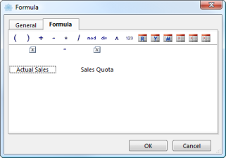
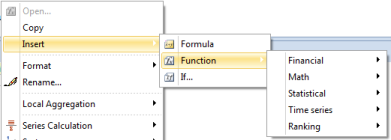

## Value Calculations

Value Calculations let you perform basic mathematical operations, advanced calculations, and compare values. You can create new values based on the existing values in the report, and do tests to check if a condition you specify is true, or false.  

The following value calculations are available:

*   Formula
*   Function
*   If  

## Formula

**Formula** combines other values and constants. With Formula you can subtract, do sums, multiply, divide, calculates mod and div. A formula may consist of values, constants, functions, if-test, series calculations and other formulas.

To insert Formula, on the **Toolbar** menu click the **Formula** button. Double-click on the formula to open. In the **Formula** pane and in the **General** tab, enter the formula name and select number format. To compose a formula, in the **Formula** tab drag in values, if-conditions or functions from the value pane.

There is also possible to use calendar time in a formula, for example day of year, day of month or week in a calculation.

## Function

**Function** uses other values as parameters to predefined formulas. A function may contain values, constants, formulas and other functions.

****

The function menu offers a function library for more advanced calculations. The library contains functions within Financial, Math, Statistical, Time series and Ranking. To insert Functions, on the Toolbar menu click on the function button. The function will be placed in Values field. To set a function, right-click on the function and point to Insert and Functions, and then click on one of the functions you want to use.

## If

****If**** performs range tests on other values. Based on a value range, it selects an output value and additional color formatting. For example you can use a logical If-function to visualize whether the sales have increase or decrease compared with the last year sales. An If-condition contains one or more test conditions, where each condition has a value range and a result value and/or colors.

To insert an If, on the **Toolbar** menu, click the **If** button. To set the condition, you can drag available value from the Values pane into the Test field. Set the test range and drag a value or add a constant into the True field and set color formatting.

