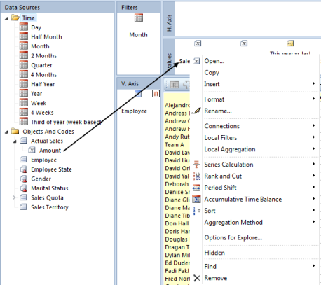
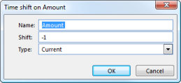
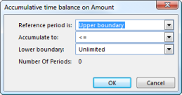
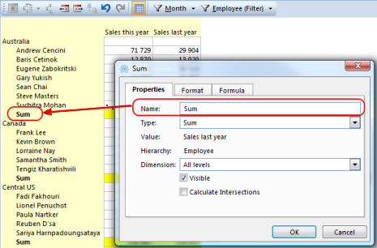
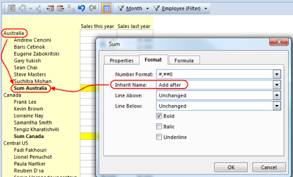

# Values

A value is bound to an object, for example the sales amount for an employee. A value defines numerical data in the report when it is placed in the **Values** field.

You can find the values in the object folders they belong to. To place data sources and values in the report, you can use a drag-and-drop operation. To change the settings for the value, right-click on the value and perform appropriate settings.

<table style="WIDTH: 100%">

<tbody>

<tr>

<th>Value Options</th>

<th>Description</th>

</tr>

<tr>

<td>**Open**</td>

<td>Open the value properties. In the **General** tab you can set the name, number format for the values. The **Connections** tab contains a list over the valuebs connections to objects.</td>

</tr>

<tr>

<td>**Copy**</td>

<td>Copy a value</td>

</tr>

<tr>

<td>**Paste**</td>

<td>Paste the copied value into the values field.</td>

</tr>

<tr>

<td>**Insert**</td>

<td>Insert Formula, Function, or If condition into to values field.</td>

</tr>

<tr>

<td>

**Format**

</td>

<td>

Customize number and chart.

*   **Number** set the number format on the value.
*   **Chart** set the valuebs appearance in charts. You can set the appearance, value axis, lines and points for chart.

</td>

</tr>

<tr>

<td>

**Rename**

</td>

<td>

Rename the value. This will also affect the column name in the report if the value is shown as a column.

</td>

</tr>

<tr>

<td>**Connections**</td>

<td>Set which objects in the report the value relates to.</td>

</tr>

<tr>

<td>

**Local Filters**

</td>

<td>

Set filter direct on the value for the data sources which is placed in Filters field. Local filters in value will overrule the filter in the report.

*   **None** none members selected.
*   ****Selection** manual selected members.**
*   ****Criteria** members from search result by given criteria.**
*   **[Saved data Filter**](data-filters.md) insert predefined data filter as filter

</td>

</tr>

<tr>

<td>

**Local Aggregation**

</td>

<td>

Aggregate the value based on selected object.

</td>

</tr>

<tr>

<td>  **Series Calculation**</td>

<td>Calculate the value based on the object or code in horizontal axis or vertical axis. A Series Calculation can for example be a sum, average, median, max, min and so on.</td>

</tr>

<tr>

<td>  **Rank and Cut**</td>

<td>

Sort and cut data in table on the value you are trying to rank. Example the function is useful when you want to show only the bottom 10 or bottom 10 results in a table. This function is only available when no objects are placed in horizontal axis and there is only one object placed in vertical axis.

</td>

</tr>

<tr>

<td>  **Period Shift**</td>

<td>

Shift time period on the value according to Time Reference. This function makes it easy to compare values in different time period.

To add Period Shift on a value, the time will shift back or forward in time.

Name set the name for the value  
Shift set the number of time period which shall move back or forward according to time reference in the filter.  
Type set the type of time period.

</td>

</tr>

<tr>

<td>**Accumulative Time Balance**</td>

<td>

Contains functionality to accrue a value backwards or forwards in time. For example this function can be used to calculate remaining budget on a given time for a project period.

To add Accumulative Time Balance, right-click the value and select Accumulative Time Balance.

Reference period is set the time limit for the aggregation.  
Accumulate to set the operator < bless thanb or <= bless than or equal tob.  
Lower boundary set the start time for the aggregation.  

</td>

</tr>

<tr>

<td>  **Sort**</td>

<td>Sort the data in the table on the value you are trying to sort. This function is only available in when only one object is place in vertical axis or horizontal axis.</td>

</tr>

<tr>

<td>**Aggregation Method**</td>

<td>Set the aggregation method like sum, average, max, min, standard deviation, count and median for the value.</td>

</tr>

<tr>

<td>**Option for Explore**</td>

<td>Set the default target to explore.</td>

</tr>

<tr>

<td>**Hidden**</td>

<td>Hide the value in the report. For example you can hide a value used in a formula from beeing visible in the report. This function is only available when there is more than one values in the values field.</td>

</tr>

<tr>

<td>**Find**</td>

<td>Show a list over values in the values field.</td>

</tr>

<tr>

<td>**Remove**</td>

<td>Remove the value from the report.</td>

</tr>

</tbody>

</table>

## Naming Series Calculations

You can customize the name of a series calculation. You need only to change the name for the series calculation on one of the values in the report. Every value referencing to same data source, will inherit the customized name. Right-click the value and point to **Series Calculation** and then click available data source, to customize name on the series calculation. In the **Properties** tab and in the **Name** field, enter the new name.

To inherit the name from the aggregated data source, in the **Format** tab and in the Inherit Name field, click **Add after**.

**Tip:** Always customize the first value in the Value field. It is easier to remember which value that controls the customized name on series calculation.  

