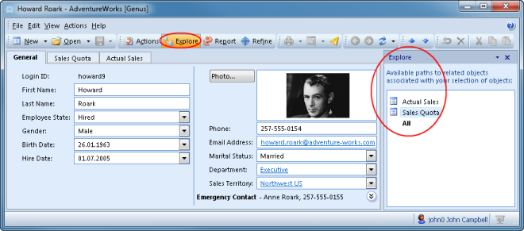
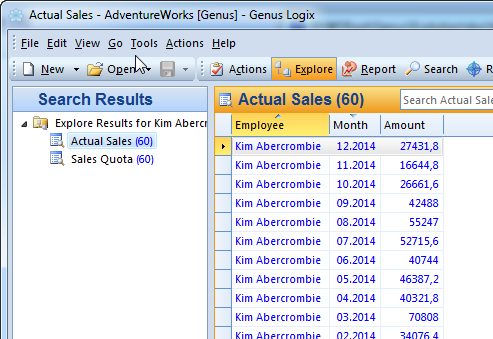

## Exploring Data

Genus offers functionality for exploring related objects through the object network. The object network is made up of objects with properties which refeferences other objects, and these paths in the network can be used to browse surrounding objects.

The **Explore Task Pane** can be opened by clicking **Explore** in the toolbar. In the list of explore links, all the relevant links are displayed based on the object or objects that are selected. Explore links can also be accessed by right-clicking an object, and then selecting **Explore** in the menu. The relevant explore links are then displayed in the sub-menu. For an overview of all related objects, select the special explore link **All**.

When selecting an explore link, a search for the related objects is performed, and the result is displayed in a new section in the **Search Result** area.

Two paths can display the same type of object, but with different filters or paths through the network. For example from Department you can explore Hired personnel and Inactive personnel, even though both are of the same Employee type of object.