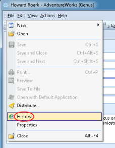
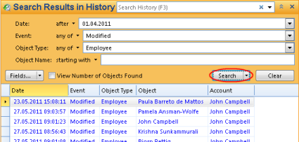
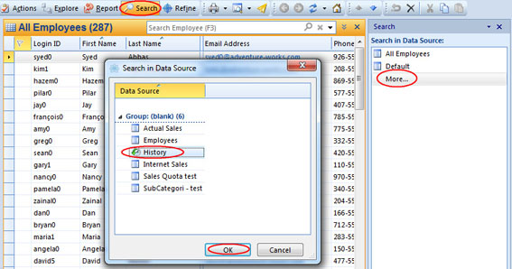

# View History

To view modifications to your object, on the **File** menu, click **History**.

In the **History** dialog box, specify a search in the **Search** pane and click Refresh. See [here](../../working-in-tables/advanced/view-history.md "View History") for more information.

## Event Types

The format and contents of the details for an event vary depending on the event type.

**Executed**

A detailed execution log containing the start time, end time and status for the execution. The amount of information traced for each execution can be specified in the history setup for the object. Available for Tasks, Agents and Web Services. For more information, see:****

*   [**View the execution history for a Task**](../../../../developers/defining-the-app-model/logic/tasks.md)
*   [**View the execution history for an Agent**](../../../../developers/defining-the-app-model/logic/agents.md)
*   [**View the execution history for a Web Service**](../../../../developers/defining-the-app-model/services/web-services/view-the-execution-history-for-a-web-service.md)

**Modify**

The source of a modified event can be one of the following:

*   The value for a property was modified. Both the old and the new value is recorded.
*   An object which is part of a composition was created.
*   An object which is part of a composition was deleted.

**Delete**

Not applicable when viewing the Event History for a single object.

**Link and Unlink**

The object which was linked or unlinked, and the property the object was linked to or unlinked from.

**Search**

Not applicable when viewing the Event History for a single object.

**Authorize**

The permissions granted or revoked for a security group or a user account on an object.

No details are logged for the event types **Read** and **Created**.

Note that if an object is part of a [composition](../../../../developers/installation-and-configuration/composition.md "Composition"), audit trails for the object are logged in the Event History both for the object and the composition. Events such as **Created**, **Modified** and **Deleted**, are logged as a **Modified** event on the composition. For example, if Contact Person is part of Customer, and a new contact person is added to a customer, the event is logged as a **Create** event on the contact person and a **Modified** event on the customer.

## Modify Auditing for an Object

Required [security permission](../../../../developers/defining-the-app-model/security/security-permissions.md "Security Permissions"): **Modify auditing**.

1.  Select the object for which you want to modify auditing.
2.  In the **File** menu, click **Properties**.
3.  Click the **History** tab.
4.  In the list **Auditing**, click the events you want to track in the Event History. Events marked with the text **All objects** are activated for all objects, and can not be deactivated for an individual object. The number of events that can be selected for an individual object is defined in the [auditing setup for all objects in the Directory](../../../../developers/defining-the-app-model/data/object-class/modify-an-object-or-identifier-domain/events.md "Events").

## Search the Event History

Sometimes it is useful to find data based on, for example, when it was changed, or who changed it. This is possible by searching the history of changes to data. For information on viewing the history for an object, see [View History](../../working-in-tables/advanced/view-history.md "View History").,

 To search in History for changes, deletions, etc, click **Search** to open the **Search** Task Pane to the right. In the **Search** Task Pane, click **More**.

Select **History** and click **OK**.

Specify your search per field as shown below and click **Search**.

 

The result appears in the table below the search fields.

By default you can only search for events logged by yourself. Users which have been granted the [security privilege](../../../../developers/defining-the-app-model/security/security-privileges.md "Security Privileges")**Combine event history for all users,** can search for events logged by any user.

The result appears in the table below the search fields.

By default you can only search for events logged by yourself. Users which have been granted the [security privilege](../../../../developers/defining-the-app-model/security/security-privileges.md "Security Privileges")**Combine event history for all users,** can search for events logged by any user.

To search in History for changes, deletions, etc, click **Search** to open the **Search** Task Pane to the right. In the **Search** Task Pane, click **More**.

Select **History** and click **OK**.

Specify your search per field as shown below and click **Search**.

 

The result appears in the table below the search fields.

By default you can only search for events logged by yourself. Users which have been granted the [security privilege](../../../../developers/defining-the-app-model/security/security-privileges.md "Security Privileges")**Combine event history for all users,** can search for events logged by any user.

The result appears in the table below the search fields.

By default you can only search for events logged by yourself. Users which have been granted the [security privilege](../../../../developers/defining-the-app-model/security/security-privileges.md "Security Privileges")**Combine event history for all users,** can search for events logged by any user.