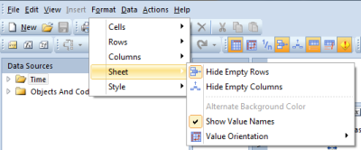
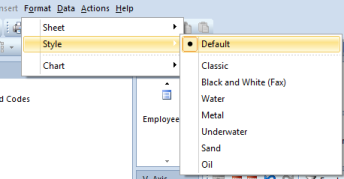
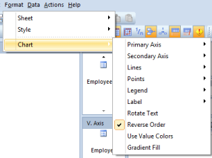

## Formatting

The formatting options help you to improve the look of your report and make them easier to read.

In this article

* * *

*   [Formatting Tables](#formatting-tables)

*   [Formatting Charts](#formatting-charts)

* * *

## Formatting Tables

For formatting tables, you can use the following formatting options:

<table style="WIDTH: 100%">

<tbody>

<tr>

<th>Formatting Options</th>

<th>Description</th>

</tr>

<tr>

<td>**Cells**</td>

<td>

Add text and fill color to cells.  

1\. Select the cells you want to add text and fill with color.  
2\. On the **Format** menu, point to **Cells** and then click **Format**.  
3\. In the **Cells** dialog box, in the **Text** field you can add text and select fill color.  
4\. In the **Font** tab, select **Use Format** to change the font format. Select color and size for the font.

Note: The formatting text and color in the report i fixed, and is recommended for use in static reports. For example in reports where drill down is not allowed.

</td>

</tr>

<tr>

<td>**Rows**</td>

<td>

Insert rows and add indent in a report.

To insert rows, do the following:

1\. Select an empty cell, where you want to insert a row.  
2\. On the **Format** menu, point to **Rows** and then click **Insert Rows**.

</td>

</tr>

<tr>

<td>**Columns**</td>

<td>

Freeze Axis Pane, change Value Width and Vertical Axis Width for columns.

</td>

</tr>

<tr>

<td>**Sheet**</td>

<td>

Hide empty rows and columns, show value Names and change value Orientation. These functions are also available in the toolbar. For more information, see [View Options](view options.md).

</td>

</tr>

<tr>

<td>**Style**</td>

<td>

Change the appearance of the report.

</td>

</tr>

</tbody>

</table>

## Formatting Charts

You can change the layout and formatting style of individual chart elements.

<table style="WIDTH: 100%">

<tbody>

<tr>

<th>Formatting options</th>

<th>Description</th>

</tr>

<tr>

<td>**Sheet**</td>

<td>

Hide empty rows and coloums.

</td>

</tr>

<tr>

<td>**Styl****e**</td>

<td>

Change the appearance for the chart.

</td>

</tr>

<tr>

<td>**Chart**</td>

<td>

Change the layout of charts elements.

</td>

</tr>

</tbody>

</table>

