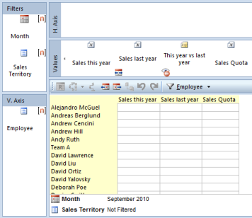

## Grouping and Filtering

Use Data Sources to group and filter data in a report. There are three types of data sources; time, objects and codes. The data sources are used to group the data along either the vertical axis or horizontal axis, and filtering the data in the report. A data source can for example be employee, sales territory, marital status, month, week, or year.

<table cellpadding="0" cellspacing="0" width="100%" class="cdclvSuggestTable">

<tbody>

<tr>

<td width="100%" class="cdclvSuggestTitle">Topics in "Grouping and Filtering"</td>

<td class="cdclvSuggestTitle"><nobr>2 items</nobr></td>

</tr>

<tr>

<td class="cdclvCategoryCont" colspan="2">

<table cellpadding="0" cellspacing="0" width="100%">

<tbody>

<tr>

<td valign="top" class="cdclvCategoryCol1">[Data Sources](grouping and filtering/data sources.md)</td>

<td valign="top" class="cdclvCategoryCol2">[Time Data Sources](grouping and filtering/time data sources.md)</td>

</tr>

</tbody>

</table>

</td>

</tr>

</tbody>

</table>