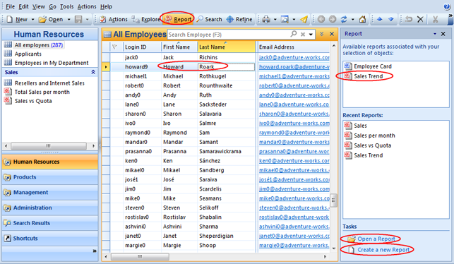
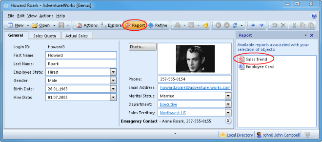

## Reporting on Data

Genus App Platform provides knowledge based analytical processing capabilities (OLAP) and reporting features. Explore your business data from multiple dimensions by pointing, clicking, and dragging, create reports, and share them to make better decisions. Anyone at any business or technical skill level across your corporation can explore large volumes of summarized data with sub-second response times.

The **Report Task Pane** can be opened by clicking **Report** on the toolbar, and contains three sections. The **Available reports assosiated wiht your selection of objects** section displays reports that can be filtered by the objects you have selected. The **Recent Items** section displays the recently used reports, and in the **Tasks** section there are links to open all available reports and to create a new report.

 

In this example, the **Sales Trend** report will display the sales per month for Howard Roark.

To create a new Report, in the **Task** section click **Create a new Report**.

For advanced users, note that Genus App Platform supports distribution of reports by making or spreading out copies for a selection of objects in a variety of formats. See [Distribute a Report](../users/reporting-on-data/report/export-or-distribute-a-report.md) for more information.

**Topics in "Reporting on Data"**
* [Analysis](../users/reporting-on-data/analysis.md)
* [Data Extract](../users/reporting-on-data/data-extract.md)
* [Report](../users/reporting-on-data/report.md)