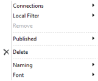
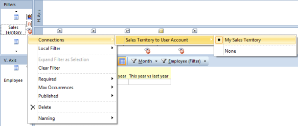
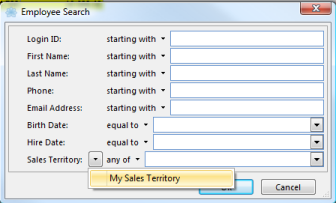
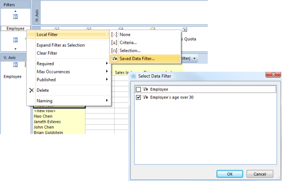
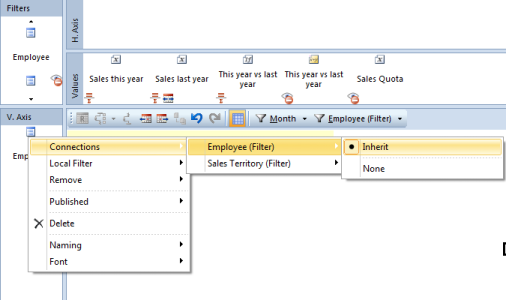
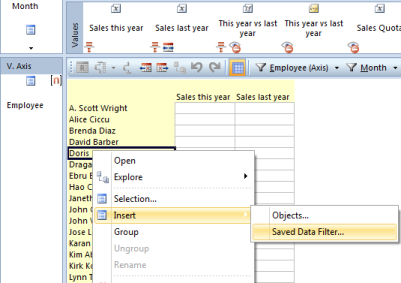
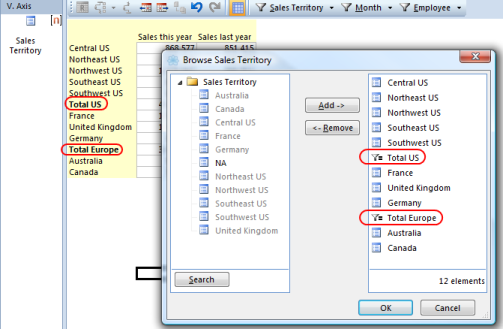

## Data Sources

To filter data in a report, a data source must be placed in **Filters** field. To group data, one or more data sources must be placed in one or both of the **Vertical Axis** field and **Horizontal Axis** field. Data sources in vertical axis and horizontal axis can also function as filters.

When creating the report, it is possible to publish the filters that should be available for the user to change. The default filters can be set as criteria or selection.  

**Data Source along vertical axis and horizontal axis.**

To change settings for a data source, right-click on the data source and select from the menu.

 <table style="WIDTH: 100%">

<tbody>

<tr>

<th>Meny Options</th>

<th>Description</th>

</tr>

<tr>

<td>**Connections**</td>

<td>Set the connections to data sources in Filters field and to other predefined connections, for example My Sales Territory.</td>

</tr>

<tr>

<td>

**Local Filter**

*   **None** (none members selected)
*   **Criteria** (dynamic selection of members)
*   **Selection** (static selection of member)
*   **Fixed**

</td>

<td>Set which type of filter to select the member the data source.  

To set default filters, right-click the data sources in filter or in the axis and point to Local Filters and clicks None, Criteria, Selection or Fixed. To select members or set criteria for the data source, double-click the data source to open.

</td>

</tr>

<tr>

<td>**Remove**</td>

<td>Remove combinations without values in report.</td>

</tr>

<tr>

<td>**Published**</td>

<td>Publish the data source, so users have rights to change the filter in report in run mode.</td>

</tr>

<tr>

<td>**Delete**</td>

<td>Delete the data source from the axis.</td>

</tr>

<tr>

<td>**Naming**</td>

<td>Customize the name of members by choosing naming properties from data source. You can set the column header and indent levels.</td>

</tr>

<tr>

<td>**Font**</td>

<td>Change font size</td>

</tr>

</tbody>

</table> 

**Data source as filter**

To change settings for a data source in Filters field, right-click on the data source and select from the menu.

<table style="WIDTH: 100%">

<tbody>

<tr>

<th>Menu Options</th>

<th>Description</th>

</tr>

<tr>

<td>**Connections**</td>

<td>Set the connection to predefined connections, for example My Sales Territory.</td>

</tr>

<tr>

<td>

**Local Filters**

*   **None** (none members selected)
*   **Criteria** (dynamic selection of members)
*   **Selection** (static selection of member)
*   **[Saved Data Filter](data-sources.md)** (insert predefined data filter as filter in report)

</td>

<td>

Set which type of filter to search or select the member in the data source.

To set default filters, right-click the data sources in filter or in the axis and point to Local Filters and clicks None, Criteria, Selection or Fixed. To select members or set criteria for the data source, double-click the data source to open.

</td>

</tr>

<tr>

<td>**Expand Filter as Selection**</td>

<td>Change filter type from criteria including its members to selection. This function is only available when the filter type is set to Criteria.</td>

</tr>

<tr>

<td>**Clear Filter**</td>

<td>Remove selected members from the data source.</td>

</tr>

<tr>

<td>**Required**</td>

<td>Set whether the data source is required or not. If required, the user has to set filter to run the report.</td>

</tr>

<tr>

<td>**Max Occurrences**</td>

<td>Set whether the user can select one or many members in filter.</td>

</tr>

<tr>

<td>

**Published**

</td>

<td>Publish the data source, so users have rights to change the filter in report in run mode.</td>

</tr>

<tr>

<td>**Delete**</td>

<td>Delete the data source from the axis.</td>

</tr>

<tr>

<td>**Naming**</td>

<td>Customize the name of members by choosing naming properties from data source. The names of the members are visible in filter pane.</td>

</tr>

</tbody>

</table>

## Data Source associated with user account

Data source associated with a user account is a useful feature. It makes it easy to create a report that displays data that are relevant to the individual user, for example within your area of responsibility. This feature assumes that the data source has a connection of type Account Relationship.

The example below shows how you can define filter in your report to display data associated with user account.

To see available connections, right-click on the data source in **Filters** field or in the **Axis** field, and then point to **Connections**. The icon  indicates that the filter is connected to a user account.

You can also set local filters on data sources in Filters and Axis field or values that filter data which is associated with your user account, if your filter is based on criteria.

## Using a Predefined Data Filter in a Report

You can use a predefined data filter as a local filter in a report. This is useful to re-use the same set of criterias across several reports, and also allows for extra subtotals without grouping on a data source. Predefined data filters are only available for data sources placed in Filters field or [values](../values.md "Values"). Note that data filter has to be created before using them. For more information about creating data filter, see [Data Filters](data-sources.md "Using a Predefined Data Filter in a Report").

**Predefined Data Filter of data sources in the Axis fields**

If you want to use predefined data filters in the axis, you can use connections to inherit the data source from filters. The data source in the axis required that local filter is none and combinations without values are removed.  

**Predefined Data Filters as Subtotal**

Predefined Data Filters can also be used to add subtotals for a selection of members along the vertical axis. To insert a predefined data filter along the vertical axis, you have to first set local filters as selection and publish the data source. Right-click one of the members along the vertical axis and point to Insert, and then click **Saved Data Filter**.

  

