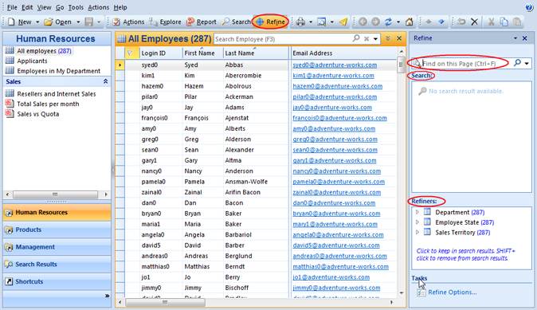
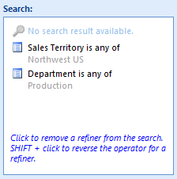
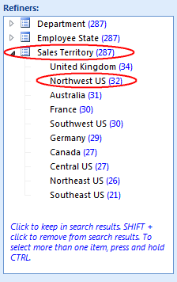
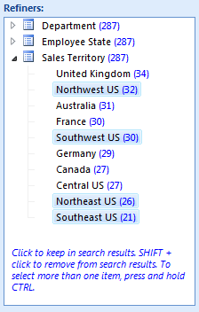
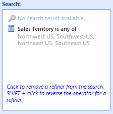
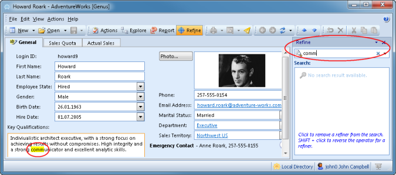
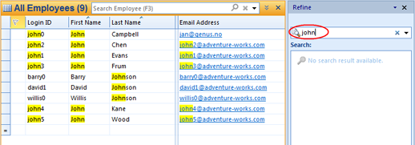
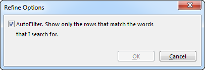

# Refining Search Results

A search result can be refined by dynamic filtering as-you-type in the **Find on This Page** box, or by using the advanced **Refiner** features.

The **Refine Task Pane** can be opened by clicking **Refine** on the toolbar, and the pane contains three sections. The **Find on this Page** field offers a quick filtering or marking of objects or texts, the **Search** section displays a summary of which refinement links have been applied to the search results, and the **Refiners** section contains the refiners and refinement links.

## Refiners

The Genus desktop client offers dynamic refinement of search results, by aggregating the result into categories, called **Refiners**. Each refiner has one or more refinement links which represents the items in that category, and each refinement link represents a filter that can be applied to the search result. By selecting a refinement link, the search result is narrowed and only matching objects are kept. Only the refinement links that are relevant in the search result are shown, and they are continuously updated in the background to reflect changes in the search result. The refiners and refinement links are available in the **Refine Task Pane**, and each refinement link displays the exact number of matching objects, so you immediately know how many objects you will get by selecting the refinement link.

**Search Section**

The search section contains a summary of the current search criteria and all applied refinement links. The first item displays the current search, and by selecting this item you can open the advanced search window to view and modify these criterias. The following items in the search are refinement links that have been selected. Select a refinement link to remove it, or press SHIFT and select it to reverse the operator for the criterion. If the search criteria are changed, the currently selected refinement links are removed from the search.

**Refiners Section**

The refiners section contains a list of the refiners that are available for the objects in the table. Each refiner displays the number of objects in the search result that matches any of the refinement links for that refiner. By selecting a refiner, it is expanded to show all its refinement links. Each refinement link displays the number of objects that matches the criteria of that refinement link.

Select a refinement link to narrow the search result, and only keep objects matching the refinement link. If you press the SHIFT key when selecting the refinement link, the operator for the criterion is reversed and only objects not matching the refinement link are kept.

For example:

A table with employees have three refiners; Department, Employee State, and Sales Territory.

Click Sales Territory to open the refiner and show the refinement links. Select Northwest US to only keep employees that works with this area.

To select more than one refinement link within one refiner, press and hold the CTRL key when selecting the refinement links. The selected refinement links are highlighted, and the selection can be changed by clicking selected and unselected refinement links as long as the CTRL key is pressed. When the CTRL key is released, the selected refinement links are applied to the search. Only objects matching any of the selected refinement links are kept. If you press the SHIFT key when selecting refinement links, the operator for the criterion is reversed and only objects not matching any of the refinement links are kept.

 For example:

A table with employees have three refiners; Department, Employee State, and Sales Territory.

Click Sales Territory to open the refiner and show the refinement links. Press and hold the CTRL key, and then click on Northwest US, Southwest US, Northeast US, and finally Southeast US. Release the CTRL key to apply the refinement links and only keep employees that works with one of the selected areas. 

  

To change the selected refinement links of a refiner, you must click the refiner summary in the search pane to remove the refiner. You can then you make a new selection of one or more refinement links from the refiner, as described above.

For information on how to add more refiners, see [Refiners](../../developers/defining-an-app-model/refiners.md).

## Find on This Page

Find on this Page is a quick and easy way to find specific text in your table or form. As you type, the matching text will be highlighted. If more than one word is entered, the different matching word are highlighted with different colors.

Find on This Page is available in the Refine Task Pane, or by pressing **CTRL + F**.

If Autofilter is enabled, only the rows in the table that contains the matching text will be display. If Autofilter is not enabled, all rows will be displayed but the rows that do not match will appear dimmed.

 To enable or disable autofilter, in the **Find on this page** field, click  and select **Autofilter**. Autofilter can also be enabled or disabled in [Refine Options](refining-search-results.md "Refine Options"). 

## Refine Options

The Refine Options let you adjust the settings for Refiners and Find on This Page.

**Autofilter**

To activate Autofilter, do the following:

1.  Open the Refine Task Page by clicking **Refine** on the toolbar.
2.  In the **Task** section, click **Refine Options**.  
    
3.  In the **Refine Options** dialog box, select **Autofilter**.  
    

For information on how this option works, see [Find on This Page](refining-search-results.md "Find on This Page").

