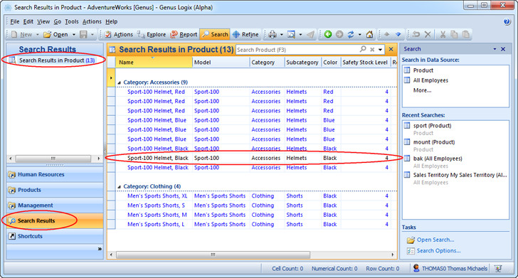
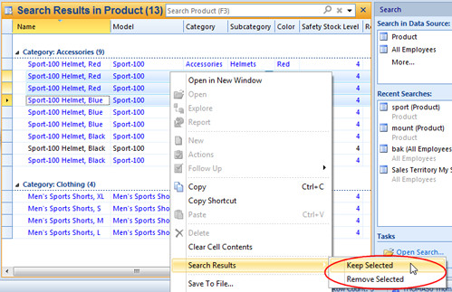

## Viewing Search Results

The result of a search is presented in the table where the search was performed, if possible. See [Search for Objects](search for objects.md) for more information. The result is also available under the **Search Results** button in the navigation pane.

In some cases the result is only available under the **Search Results** button in the navigation pane, for example when [searching in other data sources](search for other data sources.md) or <a id="ID485CC88469A94C62" title="" class="articleLink">exploring related data</a>. An exception is when [exploring data from a Report](../reporting on data/report/navigate filters and explore data.md), where the result is presented in a table in a new window, and is not available in Search Results.

The results of your searches are available under the Search Results button until you exit the application. See also [Open a Search](open a search.md) for more information on how to find all your recent searches.

When an object in the search result is opened for the first time, the color of that row in the table changes from blue to black, to indicate that the object has been read. This feature is only available in tables under the Search Results button.

There are many possibilities for viewing the search results, like grouping, sorting, and auto filtering. To learn more, see [Working in Tables](../../developers/working in tables.md). The search results can also be further modified. If you would like to remove parts of you results, select the objects you wish to keep or remove, and right-click the selection. Click on **Search Results** in the menu that appears, and then on **Keep Selected** or **Remove Selected**.

   

See <a id="ID485CC88469A94C62" title="" class="articleLink">Explore Related Data</a> for information on how to find related objects through available paths. To save a search, please see [Save Searches and Selections](save searches and selections.md). See [Open a Search](open a search.md) for informatino on how to open saved searches and selections.